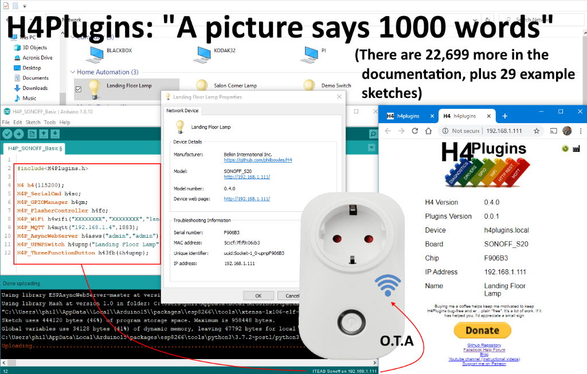
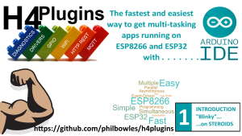
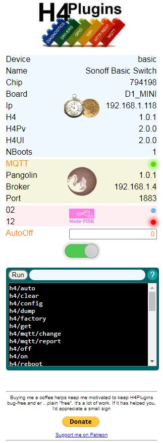
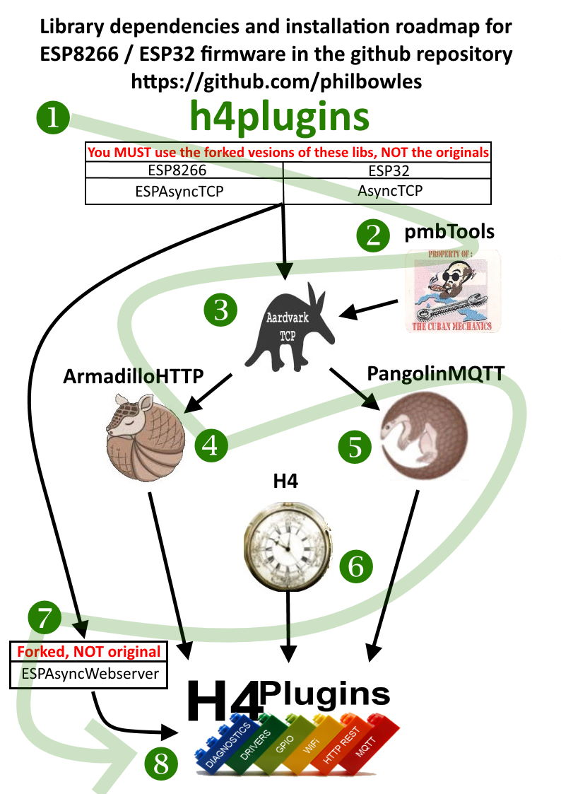
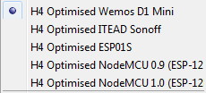

## Enables rapid development of IOT apps using WiFi, MQTT, NTP, OTA, Alexa voice control etc with an emphasis on performing multiple simultaneous functions

### Most of the above is achieved with only a few lines of code, with many features requiring on the inclusion of only a single line

28/06/2021 [Release Notes v3.2.0](docs/rn300.md)

---

## If you are able, please [Support me on Patreon](https://patreon.com/esparto) and/or subscribe to my [Youtube channel (instructional videos)](https://www.youtube.com/channel/UCYi-Ko76_3p9hBUtleZRY6g)

---

## Watch the videos

   
* [1. "Blinky on Steroids"](https://www.youtube.com/watch?v=SRHze-LRvN4)
  
   
  
* [2. Why you need it](https://www.youtube.com/watch?v=OvOz3QPGoY0)
  
---

# Documentation caveat

 This a *major* release with many changes "under the hood". There are 85 example sketches which demonstrate the all the features of library. They have all been tested, so until this message is removed, they are the one definitive source for the API, as there is SO much documentation to check and fix... [ TL;DR 6000+ lines of documenation in 40 files] with quite a bit more to come.

 I would rather get the library "out there" with bad / missing / incorrect documentation than continue to delay the release. I am working hard to bring the documentation up to date, so until It's finished, please be patient. *This* document itself is accurate and up-to-date as at 16/05/2021

Key 

* :heavy_check_mark: = As good as it's likely to get for this release
* :building_construction: = Missing / Work in Progress
* :gem: = Absolutely essential: without reading this you will find it hard going.
* :cherry_blossom: = Interesting but not 100% essential: a "sidebar article"
* :door: = "external" - takes the reader away from the current page, perhaps even offsite

 If in doubt, or you can't find something, refer first to :door: [Documentation Master Index](docs/index.md). If the file doesn't have a :heavy_check_mark:, it hasnt yet been reviewed. It *may* function as a pointer to get you started, but don't trust it 100%

 For a bit of fun, :cherry_blossom: :door: here is the [size of the task](.VSCodeCounter/2021-05-16_12-06-30/results.md)

---

# Contents

* [Introduction](#introduction)
* [Diving In](#diving-in)
* [Compatible Hardware](#compatible-hardware)
* :gem: [Installation](#installation-and-the-menagerie-roadmap)
* :door: [Overview of the 32 current plugins](docs/overview.md)
* :door: [Documentation Master Index](docs/index.md)
* :door: [Youtube Channel](https://www.youtube.com/channel/UCYi-Ko76_3p9hBUtleZRY6g)
* [What Next?](#what-next)
* [Installation](#installation)
* [Issues](#issues)

---

# Introduction

It is a simple (and unavoidable) fact of life that *successful* IOT Apps that are more than just a "blinky" require special programming techniques to do many things at once. It is also true that those techniques are complex and take a long time to learn, even for experienced programmers. H4Plugins is a method of getting you started in sophisticated IOT apps on ESP8266 / ESP32 without that steep learning curve. All the hard work has been done for you and you are left with a very simple event-driven framework into which you just drop the simple few lines of code that you want your app to do when "x" happens.

More information on *why* this is the case and why event-driven programming is the solution can be found in the pre-requisite [H4](https://github.com/philbowles/H4) library.

Think of [H4](https://github.com/philbowles/H4) and its plugins as "IOT Lego" or an "IOT Swiss Army Knife" (or both) to get your IOT app up and running in minutes rather than weeks. If you have some basic C / C++ experience then [H4](https://github.com/philbowles/H4) and its H4Plugins are for you! Most get included with only a single line of code.

You will modules (and over **80** example sketches) for WiFi + OTA, Webserver, MQTT, numerous common types of GPIO handling (e.g. debouncing, rotary encoders), Amazon Alexa voice control, NTP synchronisation, device presence detection, logging to remote MySQL server and extensive diagnostics. By "plugging " together only the required modules, you can rapidly build your own custom firmware or IOT app. Everything you build will be stable and responsive, with a built-in control panel: the plugins work together to allow multiple simultaneous processes to run, so ***no more WDT resets***! As your experience grows you can extend your app / firmware with H4Plugins' well-documented* API and runtime command system.

(* It *will* be when it's finished :) )

---

# Diving in

## Watch the video

[1. "Blinky on Steroids"](https://www.youtube.com/watch?v=SRHze-LRvN4)

---

[H4](https://github.com/philbowles/H4) and its plugin system represent a *very* different way of getting started on ESP8266 from the "standard" examples found all over the web.

There are many good reasons for that but it means that there are a few things you need to know about [H4](https://github.com/philbowles/H4) and how it works before "diving in" to the H4Plugins system. Spending a few minutes reading [the basics of H4](https://github.com/philbowles/H4#why-do-i-need-it) will save you days and even weeks of effort, so please digest it all before trying some of the 80+ examples in this repo - it will be time well spent!

Once you "get" how H4 and the plugin system work, you will be able to churn out fully working, multi-functional **stable** IOT apps on ESP8266 in only a few lines of code, compared with literally *hundreds* of lines in the "standard" way of doing things. That's if you can even find anything close to what you need...

To get a "feel" for just how different H4 and H4Plugins are from all the other examples you will find on the web, let's see an example of H4Plugins being used to build replacement firmware for a SONOFF Basic switch.


## SONOFF Basic Example

What follows is the *entire H4Plugins code* - despite the fact it might look like there is something missing, there is not. The code as shown compiles to produce firmware that can be uploaded directly to your SONOFF device and provides:

* Seamless autoconnect/reconnect of failed WiFI and/or MQTT with no reboot
* OTA
* Full control via Serial console
* Full control via MQTT plus automatic publishing of state change
* Full control via built-in Web console
* Single-button control for on/off, reboot, factory reset depending on the time pressed down
* LED pattern signalling, e.g. ... --- ... ("SOS") = No WiFi, two short blips = no MQTT etc
* HTTP REST-like control from any other device with JSON response
* Dynamic reconfiguration of SSID, MQTT server, Alexa UPNP device name
* UPNP device control from e.g. Windows Network Explorer
* Amazon ECHO "Alexa" voice control
* Auto-off timeout if required, which persists across reboots

```cpp
#include<H4Plugins.h>
H4_USE_PLUGINS(115200,H4_Q_CAPACITY,false) // Serial baud rate, Q size, SerialCmd autostop
H4P_WiFi wiffy("XXXXXXXX","XXXXXXXX","basic");
H4P_AsyncMQTT cutie("http://192.168.1.4:1883");
H4P_BinarySwitch relay(D6,ACTIVE_HIGH);
H4P_UPNPServer lexy("Sonoff Basic Switch");
h4pMultifunctionButton mfb(0,INPUT,ACTIVE_LOW,15); // 15ms of debounce
```

And here's what you see when you point your browser to the webserver running inside the device:



The "big red switch" switches the device on / off. GPIO12 (D6) is lit up in red showing the device's relay is currently OFF - it will go green when the device is ON, similar to the green LED showing that MQTT is currently connected successfully. The builtin LED on GPIO2 is blue on the test board, but you can make it whatever colour matches your actual board.

You can also switch the device using MQTT, HTTP, serial monitor, Alexa voice command an *even* the physical button if you simply *have* to. The button is debounced, and if you hold it down for longer than 2 seconds, the built-in LED will start to flash to warn you that when you release it, the device will reboot.

If you hold down the uswr button for longer than 5 seconds, the device will "factory reset" and clear any saved values, such as the Auto-off timer if you have ever changed it from zero.

You also get a "web console" that allows yout to control the device in the same way as if you were connected via a Serial link. On Windows, it is also visible to your PC's Network Explorer and you can control the device with the right-click menu:


As you can see, pretty much all you need to do is list the modules/functionality you require and provide a few necessary starting values such as ssid / passwords etc. The plugins link up with each other, exchange messages between themselves and "stitch" everything together into a seamless piece of stable firmware. 

Not bad for 7 lines of code, I think you'll agree :smile: - If you know of anything easier, please let *us* know too!

---

## Designed for programmers

The modular design of H4's plugin architecture minimises scarce resources in low-memory MCU targets: You only compile in what you need by choosing the relevant bulding blocks. Detailed logging and/or diagnostics can be easily included (or completely compiled-out) and controlled at runtime via the serial console, web console, HTTP REST or MQTT depending on which options you choose. It is built on top of the very stable [H4](https://github.com/philbowles/H4) timer/scheduler which traces its ancestry back to "Esparto" - of which one user recently said: *"and now have Esparto modules with months of uptime without any issues"*.

There are over 80 example sketches demonstrating all the features and the APIs of all of the plugins. They should be used both as a template for your own sketches and as a learning resource.

Each plugin is also throroughly documented in the links below. *Please make sure you have read and fully understood the documentation for the [H4 library](https://github.com/philbowles/H4) and the relevant Plugin(s) before raising an issue.*

Also please prefer the [Facebook H4  Support / Discussion](https://www.facebook.com/groups/444344099599131/) group over the github issues mechanism, as I don't look at github that often, nor open my email until it backs up, but I'm on FB pretty much every day and you will get a much quicker response.

---

# Compatible Hardware

* ESP8266 - any board e.g. nodeMCU, Wemos D1 Mini etc
* ESP8285 - any board e.g. Wemos D1 mini Lite
* ESP32 - any board e.g. DevKit, Lolin D32
* SONOFF Basic, S20, SV and RF. Others may work too if ESP8266 based

---

# Installation and the "menagerie" roadmap

H4Plugins sits at the top of a structure of underlying libraries with strange names, whihc we like to call "the menagerie". Each of them can be used in its own right without needing H4Plugins, but they all work best when H4Plugins pulls them all together and manages them.

SEE [Installation](#installation)


## The related / dependent libraries

|| Name | Provides | Notes |
| :---: | :----------  | :--- | :--- |
||[Forked AsyncTCP](https://github.com/philbowles/AsyncTCP)|"Glue" to LwIP (ESP32)| Important bugfixes |
||[Forked ESPAsyncTCP](https://github.com/philbowles/ESPAsyncTCP)|"Glue" to LwIP(ESP8266)| Missing features added |
||[Forked ESPAsyncWebserver](https://github.com/philbowles/ESPAsyncWebServer)| Basis of webUI in H4Plugins| Several major bugfixes |
||[PMB Tools](https://github.com/philbowles/pmbtools)|'32/'8266 HAL and utility functions| |
||[AardvarkTCP](https://github.com/philbowles/AardvarkTCP)|Simple Large-payload Async TCP| API-compatible with ESPAsyncTCP, seamless TLS/SSL |
||[PangolinMQTT](https://github.com/philbowles/PangolinMQTT)|Async MQTT Client|QoS 0/1/2 Fully 3.1.1 compliant. Large payloads |
||[ArmadilloHTTP](https://github.com/philbowles/ArmadilloHTTP)|Async HTTP/S Client| Simple send/callback of large payloads |
||[H4](https://github.com/philbowles/H4)|Scheduler/Async Timers| |
||[H4/Plugins](https://github.com/philbowles/h4plugins)|Full Async IOT Firmware| Webserver, MQTT, OTA, NTP, HTTP etc etc |



H4Plugins is tested using

* ArduinoIDE 1.8.13 (and beta 2.0)
* ESP8266 core 2.7.4
* ESP32 core 1.0.4

---
## Tools / Build Guidelines

To reduce the footprint of the binary code and provide best WiFi / MQTT performance, the following IDE options
are recommended (if available for the chosen board):

## For ALL sketches


### **IMPORTANT**

WiFi sketches must reserve LittleFS space to hold the configuration web UI pages. These take < 96K so allocate the minimum LittleFS possible that is greater than or equal to 96k and remember to copy the `data` folder to the sketch folder and upload using either the  [LittleFS upload tool](https://github.com/earlephilhower/arduino-esp8266littlefs-plugin) or the [ESP32 sketch data uploader](https://github.com/me-no-dev/arduino-esp32fs-plugin) (or both) depending on which platform you compile for.

On 4MB devices the minimum sensible/easy FS is 1MB. On 1MB devices, the 96k is an unudual size, not freely available. It is easy to add, however - see the section in [Advanced Topics](docs/advanced.md)

## H4 Optimised Board Definitions

See [Advanced Topics](docs/advanced.md) for how to simply add H4 optimised board definitions that will ensure you get the smallest possible binary (and therefore most likely to be OTA-able). They make compiling for different targets a) very quick b) foolproof. Almost.




---
# What next? 

There is *a lot* in this library, its pre-requisite: the [H4](https://github.com/philbowles/H4) library and the rest of "the mangerie". For a start, there are over 30 individual plugins, as well as several new concepts to learn, although you will probably only use 6 or 7 of the more common / important ones for most of your apps.

Then there are over 80 example sketches in the two libraries. That's not a typo: it's "over eighty". Every plugin and every possible API call is demonstrated at least once somewhere in that collection. Its designed to help you get up to speed quickly - use it! 90% of the time you will find the start (if not *all*) of the app you want to write.

After you have finished reading this file, the recommended path you should follow for mastery of these libraries is:
## Step-by-step guide to mastery

1. Download, install and play with [H4](https://github.com/philbowles/H4). Pick one or two of the examples and run it. There is no better way to learn that actually *doing it*

2. Read the [H4](https://github.com/philbowles/H4) documentation *fully*. Everything H4 does is based on using the features of [H4](https://github.com/philbowles/H4). All of the examples here use the [H4](https://github.com/philbowles/H4) API extensively. If you don't "get" [H4](https://github.com/philbowles/H4) you will certainly not be able to use H4Plugins to its best. Next, make some small changes to one or two of the examples, or be brave and write your own

3. By this point you will have got "the feel" of event-driven programming and how *everything* is done in H4Plugins.

4. Watch the [first video](https://www.youtube.com/watch?v=SRHze-LRvN4) in the training series

5. Read 
   * [Everything is an event: Listeners, Emitters and Handlers](docs/events.md)
   * [Global Variables and persistent storage](docs/globals.md)
   * [Common Command and Control: H4P_SerialCmd](docs/globals.md) 
  
    These three concepts are the entire basis of H4 and the plugins system, They form the core of any / all apps you will create. Once you have these three "under your belt" all the rest of the plugins and examples just fall into place.

    Without these three, everything is going to look like gibberish so ***DO NOT SKIP THIS STEP***
   
6. Read [Switches and Things](docs/things.md) as the vast majority of simple apps will have one of these as is main function...
   
7. ...such as the [basic sonoff app](examples/XTRAS/H4P_SONOFF_Basic/H4P_SONOFF_Basic.ino) (it works on pretty much any hardware) Compile it and play with controlling it via serial, builtin webserver, mqtt , rest etc
   
8. Read [Event Listeners and Event Emitters](docs/h4logs.md) because in this class are some incredibly useful tools for helping you debug your code and log any problems or errors as you get more adventurous.
   
9. Now work your way through several of the [GPIO examples](examples/GPIO). Start with ["raw"](examples/GPIO/H4GM_Raw/H4GM_Raw.ino) and then ["debounced"](examples/GPIO/H4GM_Debounced/H4GM_Debounced.ino) - once you understand those two all the rest will start to make a lot more sense. If you DO have a [rotary encoder](examples/GPIO/H4GM_Encoder/H4GM_Encoder.ino), hook it up and delight in the ease with which you will be able to use it!
   
10. Try a few of the other examples to give yourself an idea of the range and flexibility of the whole system
    
11. Read the [Advanced Topics](docs/advanced.md) document for how to set up and deploy an entire self-updating cloud-free framework controlled by NODE-RED

12.  At each stage above, check out the dedicated [H4Plugins Youtube channel](https://www.youtube.com/channel/UCYi-Ko76_3p9hBUtleZRY6g) to see if the relevant video has been produced yet - I'm workin as fast as I can to get a whole video library out there for you.

---

# Installation

Please see [H4 Installer](https://github.com/philbowles/h4installer)
# Issues

## If you want a *quick* resolution, please follow these rules:

1. As with all H4 and H4Plugins libraries, please make sure you have read *all* the relevant documentation relating to the issue and watched any videos on the [Youtube channel (instructional videos)](https://www.youtube.com/channel/UCYi-Ko76_3p9hBUtleZRY6g). Please also subscribe to the channel for notifications of news and updates.

2. If you still think there is a problem, then join the [Facebook H4  Support / Discussion](https://www.facebook.com/groups/444344099599131/) group and report the issue briefly there. This is because I visit the group every day, whereas I do not have time to visit 11 github repos every day. Furthermore, it alerts other users to potential problems and allows an initial assessment. 

3. If there is a genuine issue then you will be referred to [Raising H4/H4Plugins issues](https://github.com/philbowles/h4plugins/blob/master/docs/issues.md) after which you are advised to create a full github issue report.

4. Failing to make an initial report in the [Facebook H4  Support / Discussion](https://www.facebook.com/groups/444344099599131/) group and simply starting with a github issue, or failing to include all of the information required in [Raising H4/H4Plugins issues](https://github.com/philbowles/h4plugins/blob/master/docs/issues.md) is likely to result in a ***long*** delay before it gets picked up.

---

(c) 2021 Phil Bowles h4plugins@gmail.com

* [Support me on Patreon](https://patreon.com/esparto)
* [Youtube channel (instructional videos)](https://www.youtube.com/channel/UCYi-Ko76_3p9hBUtleZRY6g)
* [Facebook H4  Support / Discussion](https://www.facebook.com/groups/444344099599131/)
* [Facebook General ESP8266 / ESP32](https://www.facebook.com/groups/2125820374390340/)
* [Facebook ESP8266 Programming Questions](https://www.facebook.com/groups/esp8266questions/)
* [Facebook ESP Developers (moderator)](https://www.facebook.com/groups/ESP8266/)