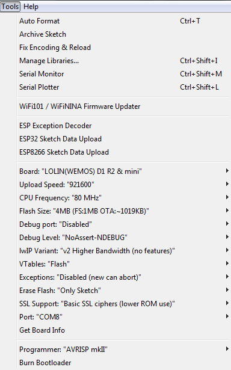

 
# Advanced Topics

- [Advanced Topics](#advanced-topics)
  - [- Installation of Windows components for UPNP server](#ul-liinstallation-of-windows-components-for-upnp-serverli-ul)
- [Deploying multiple devices](#deploying-multiple-devices)
  - [Generic devices / naming](#generic-devices--naming)
- [Remote update](#remote-update)
  - [Creating the update repo](#creating-the-update-repo)
    - [SPIFFS](#spiffs)
    - [Firmware](#firmware)
    - [NODE-RED H4 Updater flow](#node-red-h4-updater-flow)
- [Optimising binaries for production and/or OTA](#optimising-binaries-for-production-andor-ota)
  - [H4 Optimisation](#h4-optimisation)
  - [Compilation Optimisations](#compilation-optimisations)
- [Installation of Windows components for UPNP server](#installation-of-windows-components-for-upnp-server)
---

# Deploying multiple devices

If you have only one or two devices, compiling code spearately for each one is no big deal. If, on the other hand you have 20 or 30 tat all need to run thesme code, it rapidly becomes a chore to keep them all up-to-date.

In this section we look at some techniques to make this not only simple, but automatic.

## Generic devices / naming

If no device name is given in the H4P_WiFi constructor, it defaults to H4_XXXXXX where XXXXXX is the unique chip ID of the device (usually the last 6 characters of the MAC address).

This is useful to enable a single common sketch to be uploaded to numerous devices without change. Each device should then be sent a `H4_XXXXXX/h4/wifi/host` with a payload of its "real " name. This can be done by any MQTT client using stored messages (e.g. NODE-RED) so that each device gets its own name when it reboots after an update. The device will then reboot with its onw name and stay that way until the next code/spiffs update or it is focred into AP Mode.

Similarly, with UPNP_Server, omitting a specific names results in the device being known as "upnp <chip-id>". Again, a stored MQTT message of `H4_XXXXXX/h4/upnp` with a payload of its "friendly name.

To prevent *two* reboots, H4P_WiFi also has the `H4_XXXXXX/h4/wifi/host2` command, allowing you to specify bot the device name and friendly name in one call, saving a reboot. The payload is "device name,friendly name".

Below is an example "generic" sketch that I use in all my Itead SONOFF devices.
[Generic SONOFF sketch](../examples/XTRAS/Generic_SONOFF/Generic_SONOFF.ino)

...and the next is to set up and store retained MQTT messages for the complete configuration for all my own home IOT devices.
[Create MQTT retained messges configuration](../examples/XTRAS/ChezToiioT_Config/ChezToiioT_Config.ino)

---

# Remote update

The generic sketch above is fine, but what happens when you make a change and need to deploy it to 30 devices? This is when [Remote Update](h4ru.md) comes into play.

In its simplest form, you create a server which holds a repository of the latest SPIFFS images and MCU-specific firmnware images. Setting up the server is beyond the scope of this document but see the nodejs/express sever which does this for you, or the NODE-RED H4 Updater flow below.

[NodeJS/Express update server](../examples/LOGGING/H4P_HttpMySQLLogger/mysqlrest/h4.js)

## Creating the update repo

### SPIFFS

Firstly you will need the [`mkspiffs`](https://github.com/igrr/mkspiffs) utility which takes a `data` folder and builds a binary which you can place in your repo. Different devices will need diffierent sized SPIFFS binaries, H4 standardises on two types of device

* 1M devices e.g. SONOFF, ESP8285, ESP01/S etc. These are allocated 64k SPIFFS images
* 4M devices - pretty much everything else, Wemos D1 mini, nodeMCU, ESP32 etc and these are allocated 1MB SPIFFS images

[H4P_RemoteUpdate](h4ru.md) requires the dvices to be named `spiffs_X.Y.Z_1M.bin` and `spiffs_X.Y.Z_4M.bin` where X.Y.Z is the SPIFFS version number, e.g. 0.5.4

The SPIFFS version number must be contained in a file named [`h4sv`](../data/h4sv) in the `data`folder, containg just the X.Y.Z format version number on a single line

A very basic [Windows command-line batch file](../SPIFFS/spiffs.bat) utility has been created which will build both files using the version found in the `data\h4sv` file.

Summary of steps:
1. edit data folder
2. edit `h4sv` with latest version number
3. copy sketch `data` folder to `SPIFFS/data` folder
4. run spiffs.bat with new version number
5. copy generated `.bin` files to your update repository
6. publish e.g. `all/h4/rupd/spiffs`

### Firmware

Set up the correct device type / spiffs options etc for your sketch and use the Arduino IDE `Sketch/Export compiled Binary` menu option to produce a binary. Copy this binary to your repo and then run `.../h4/rupd/update` (It only makes sens to run the update for devices that match that MCU type, so `all/...` is inefficient: devices that cannot possibly require this new firmware will deluge the update server with pointless requests)

Unlike SPIFFS where a specific version number is required in the binary name, the firmware has its compilation date/time automatically compiled in. It will then get back any same-named binary with a later date/time* when it asks the server for an update. This makes the whole process a lot easier/quicker: just `export` a binary for each MCU type, copy them all to your repor and issue the relevant ``update` command.

(* Technically speaking, the timestamp of the binary on your update repo will *always* be later than the actual compilation timestamp because it takes a few seconds to compile and copy it. The example update server (and NODE-RED flow) both allow a leeway of 30 minutes differnece between the two. In effect when a device requests an update is it asking for a binary that is *"at least 30 minutes older than me"*.

If we didn't do it this way, it would update *every time* it asked) - that won't harm anything as it will be the exact sam version it already is, but it's a waste of time!)

### NODE-RED H4 Updater flow
C:\Users\phil\AppData\Local\Temp\scp50525\home\pi\.node-red\settings.js
    functionGlobalContext: {
        'path' : require('path'),
        'fs'   : require('fs'),
    },


```javscript
[
    {
        "id": "4f02ee37.9678e",
        "type": "tab",
        "label": "H4 Updater",
        "disabled": false,
        "info": ""
    },
    {
        "id": "1db3e693.db6109",
        "type": "http in",
        "z": "4f02ee37.9678e",
        "name": "/update/:type/:date/:time",
        "url": "/update/:type/:date/:time",
        "method": "get",
        "upload": false,
        "swaggerDoc": "",
        "x": 255.5,
        "y": 145,
        "wires": [
            [
                "a9253f25.6403a"
            ]
        ]
    },
    {
        "id": "a9253f25.6403a",
        "type": "function",
        "z": "4f02ee37.9678e",
        "name": "Check Latest Version",
        "func": "const repo=\"/home/pi/H4firmware\"\nconst leeway=30 // leeway between compiling & copying to repo to prevent new boot loop\nlet type=msg.req.params.type\nlet rqdate=Date.parse((msg.req.params.date+\" \"+msg.req.params.time).replace(/_/g,\" \"))\nlet d=new Date(rqdate+(1000*60*leeway)) // 30-minute leeway\nlet h=msg.req.headers\nif(h[\"x-esp8266-mode\"]===\"sketch\") {\n    switch(type){\n        case 'SONOFF_BASIC':\n        case 'SONOFF_S20':\n        case 'SONOFF_SV':\n            bin=\"itead\";\n            break;\n        case 'WEMOS_D1MINI':\n            bin=\"d1_mini\";\n            break;\n        case 'GENERIC':\n            bin=\"generic\";\n            break;\n        default:\n            bin=\"XXX\";\n    }\n    let X=`${repo}/H4.ino.${bin}.bin`\n    context.global.fs.stat(X,function(err,latest){\n        if(!err && (d.toISOString() < latest.mtime.toISOString())) msg.payload=context.global.fs.readFileSync(X)\n        else msg.statusCode=304;\n        node.send(msg)\n        node.done()\n    })\n}\nelse {\n    let sz=parseInt(h['x-esp8266-chip-size'])/1048576;\n    let version=h[\"x-esp8266-version\"];\n    let files = context.global.fs.readdirSync(repo).filter(fn => fn.endsWith(sz+\"M.bin\"));\n    files.sort().reverse() // latest first\n    let latest=files[0].substring(7,12) // chop out version\n    if(version < latest) msg.payload=context.global.fs.readFileSync(repo+\"/\"+files[0])\n    else msg.statusCode=304\n    return msg\n}\n",
        "outputs": 1,
        "noerr": 0,
        "x": 488,
        "y": 145,
        "wires": [
            [
                "55c0bb2a.880414"
            ]
        ]
    },
    {
        "id": "55c0bb2a.880414",
        "type": "http response",
        "z": "4f02ee37.9678e",
        "name": "Send HTTP Reply",
        "x": 704,
        "y": 146,
        "wires": []
    },
    {
        "id": "813f830c.31324",
        "type": "comment",
        "z": "4f02ee37.9678e",
        "name": "Incoming ESPhttpUpdate",
        "info": "",
        "x": 244.5,
        "y": 103,
        "wires": []
    },
    {
        "id": "470f409.fd83cc",
        "type": "comment",
        "z": "4f02ee37.9678e",
        "name": "Is Vn(incoming) < Vn(repo) ?",
        "info": "",
        "x": 493.5,
        "y": 192,
        "wires": []
    },
    {
        "id": "51636172.da02f",
        "type": "comment",
        "z": "4f02ee37.9678e",
        "name": "If so, send binary, else return 304",
        "info": "",
        "x": 739.5,
        "y": 104,
        "wires": []
    }
]
```

---

# Optimising binaries for production and/or OTA

Devices that are not connected to a PC via USB-Serial cable do not need to 'listen' for input commands, and sending any 'Serial.print' type output is also pointless. Once your code is working, it is best to turn off both those options to make the binary both faster and smaller.

## H4 Optimisation

1. Always use the mandatory sketch header options 0 for Serial speed and `true` for `autostop`, e.g:

```cpp
H4_USE_PLUGINS(0,20,true) // Serial baud rate=0 == OFF; autostop=true == faster binary
```

This switches off any serial output and auto-stops the H4P_SerialCmd wasting time listening for input. This step alone will make your sketch run almost 2x faster

2. Remove any `h4UserEvent` or `Serial.print...` from your code: step 1 means they won't do anything anyway, so losing them reduces the size of the binary

3. Unless you are using MySQL or MQTT logging, edit [config.h](../src/config.h) and remove or comment out the lines containing `#define H4P_LOG_EVENTS` This stops *all* loggers from doing anything: it actually removes the logging code from the binary

## Compilation Optimisations

There are several compile-time options for most devices (in the `tools` menu) that can affect the size and/or performance of your sketch. It is easily possible to produce a sketch that is too big for OTA if these options are used unwisely.

To simplify your life, H4 provides some extra boards definitions which have all the correct setting "baked in" for best performance / smallest size, for


To "install" these you need to copy the [boards.local.txt](../boards.local.txt) form this repo to the Arduino IDE folder contating `boards.txt` which will look something like:

`C:\Users\phil\AppData\Local\Arduino15\packages\esp8266\hardware\esp8266\2.6.3`

Once the file is copied, restart the IDE and you will see the new options in the boards menu

For any device not mentioned, these are the settings recommended. The example is for a 4M device, so 1MB SPIFFS is selected: on a 1MB device, select the 64K option



---

# Installation of Windows components for UPNP server

***N.B.** It seems Windows has a bug(!) in handling Wemo UPNP devices. Until this is fixed or a workaraound is found, the only way to activate your H4 device using UPNP is indirectly via MQTT*

Until such time as an installation script is written (soon, I promise :) ) getting the windows functionality is a bit of an ordeal, I'm afraid.

The first thing you need to do is to locate you Arduino library installation folder for H4Plugins, it will be something like `C:\Users\phil\Documents\Arduino\libraries\H4Plugins`

The files you will need are in the `src` subfolder

1. Install Powershell if you dont already have it and set it up so that it can run code without needing admin rights More information [here](https://superuser.com/questions/106360/how-to-enable-execution-of-powershell-scripts) 

2. Install [m2mqtt](https://github.com/eclipse/paho.mqtt.m2mqtt) You may find it easier to first install [nuget.exe](https://www.nuget.org/downloads) and run `nuget.exe install M2Mqtt -o c:\lib`

3. Edit h4p.reg and change the location in the final to match your username  Then right-click on that file and select "Merge" to add it to the registry

---

(c) 2020 Phil Bowles h4plugins@gmail.com

* [Youtube channel (instructional videos)](https://www.youtube.com/channel/UCYi-Ko76_3p9hBUtleZRY6g)
* [Blog](https://8266iot.blogspot.com)
* [Facebook H4  Support / Discussion](https://www.facebook.com/groups/444344099599131/)
* [Facebook General ESP8266 / ESP32](https://www.facebook.com/groups/2125820374390340/)
* [Facebook ESP8266 Programming Questions](https://www.facebook.com/groups/esp8266questions/)
* [Facebook IOT with ESP8266 (moderator)}](https://www.facebook.com/groups/1591467384241011/)
* [Facebook ESP Developers (moderator)](https://www.facebook.com/groups/ESP8266/)
* [Support me on Patreon](https://patreon.com/esparto)
