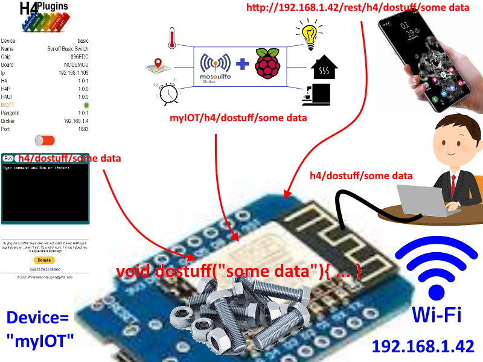
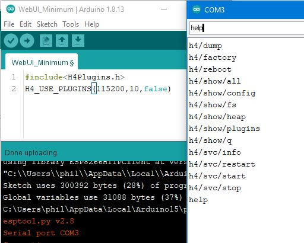
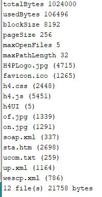
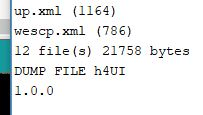
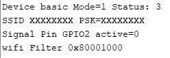
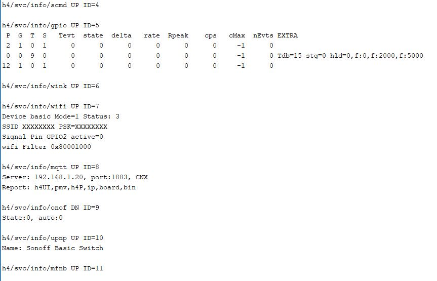
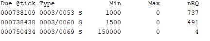
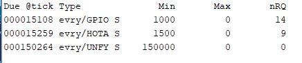

# H4P_SerialCmd plugin and the common command core

:gem: Essential background for getting started with H4Plugins

---



# Contents
* [The "Common Command Core" concept](#the-common-command-core-concept)
* [Your first plugin: H4P_SerialCmd](#your-first-plugin-h4p_serialcmd)
* [The "Plugin is a Service" concept](#the-plugin-is-a-service-concept)
* [Commands provided by H4P_SerialCmd](#commands-provided-by-h4p_serialcmd)
* [Error messages](#error-messages)
* :door: [Formal API Specification H4P_SerialCmd](h4p.md)
* :door: [Youtube video showing this in action](https://www.youtube.com/watch?v=SRHze-LRvN4&t=209s)

---

# The "Common Command Core" concept

Take a simple device that switches on a relay, perhaps connected to a lamp. Its most fundamental control mechanism is to be switched either ON or OFF....maybe something like this:


H4Plugins allows that switching to be done in a number of ways, including:

* Physical GPIO switch
* MQTT message
* Web User Interface
* Serial Console
* Remote HTTP REST-like interface
* Internal program code
* Linked internal events
* Amazon Alexa Voice command

(Depending on which plugins you choose to include in your app)

H4/Plugins tries to make the format of all those commands as close as possible and one single, common piece of code is called no matter from which source the event came. For historical reasons, the overall format is very similar to an MQTT topic.

For example, imagine our device is called `demo` and is on IP 192.168.1.4

* If I am connected to it via a serial console, to turn it on I could type:

`h4/on`

* If I have an MQTT client, I could publish the topic:

`demo/h4/on`

* If I have some other code such as NODE-RED running, I can send an http:// request:

`http://192.168.1.4/rest/h4/on`

* If I click the "Big red button" on the web user interface, the javascript actually sends an ajax request to itself:

`http://192.168.1.4/rest/h4/on`


* I can turn it on from code in several ways:

```cpp
    h4p.invokeCmd("h4/on"); // invoke any command you could type at the serial console, from MQTT etc
    ...
    h4onof.turn(ON); // most plugins have direct calls that map 1:1 onto the commands
```

Quite simply a command is a command is a command no matter where it comes from. Subject to the necessary quirks of each source, the final part of the command is always the same. This means that when reading the documentation, only that last part of the command is described, no matter how simple or how complex its effect may be.

If it can be done by *any* of the methods described above, it can - by definition - be done by *all* of them. In the documentation or support groups you might see "try giving it an h4/reboot" or "what is the result of an h4/show/config?" and how you actually do that to *your* device depends entirely on what plugins you have included: in effect the actual command itself is disconnected from its source - how you choose to get the command into the device is up to you, but the device will do exactly the same thing (calling the "common command core" function) whichever method you choose.

Every plugin has the ability to add its own specific commands on top of those provided by `H4P_SerialCmd` itself. Details of the additional commands that each plugin adds (if any) are found in the API documentation for the relevant plugin - here we will discuss only those that come already "baked-in" no matter what plugins you add for yourself.

---

# Your first plugin: H4P_SerialCmd

## What does it do?

`H4P_SerialCmd` is the "command and control" centre of H4 and its plugin system. It does everything you have read about so far.  It is so important that it is included automatically when you use the mandatory opening sequence of any and all H4Plugins sketches:

```cpp
#include<H4Plugins.h>
H4_USE_PLUGINS(115200,H4_Q_CAPACITY,false) // Serial speed, Q size, SerialCmd autostop
```

If you put in a Serial speed, make sure your monitor matches and you will see any output messages. 

Next is the size of the H4 queue. `H4_Q_CAPACITY` is just a system-wide default value, currently 10. Some features or techniques may need  bigger queue, you will be told about those when necessary. Until you become more expert. just leave it as it is.

Finally, if you are ready to deploy your app "in the wild" and you will never "talk" to it with a serial cable again, stopping the Serial message handler will improve the performance quite a lot: saying 'true' here says, *"Yes, I want to stop the serial handler, there's no point in wasting machine cycles!*" Until then, and all the time while testing, leave it at 'false' meaning  *"I do **not** want to stop talking to my MCU!"*

A single global instance is already declared for you and can be accessed by calling any of the methods on `h4p` for example:

```cpp
    h4p.info();
```

Do *not* try to instantiate a `H4P_SerialCmd` object yourself!

---

## Command format

The general concept of the command-line format is designed to emulate MQTT. The major difference is that the sources other than MQTT have no separate field for the payload, so the last item of the command in those cases is treated as the payload. For example, using the Serial monitor:

```cpp
h4/some/cmd/with/many/levels/42,666
```

The payload is "42,666" and the command is handled exactly the same way as an MQTT command with a topic of `h4/some/cmd/with/many/levels` and  payload of "42,666"

## Direct invocation of commands from code

Any command that can be typed on the console, received from MQTT or the http REST interface can be called from your own code using one of two methods:

* InvokeCmd

SerialCmd provides the `invokeCmd` function which takes parameters for topic and payload. Using the above example, you could call it thus:

```cpp
h4p.invokeCmd("h4/some/cmd/with/many/levels","42,666");
```

* Direct call

Generally, each plugin also provides native C++ functions that correspond to the command-line equivalent (the actual "commond command core" function itself) which are far more efficient than the `invokeCmd` method. At the end of the analysis, `invokeCmd` is only going to end up calling the function you could have called directly yourself! For example, calling

```cpp
h4p.showQ();
```

Has the same effect as typing `h4/show/q` at the console, MQTT publishing a topic of `yourdevicename/h4/show/q`, your code (pointlessly) calling` h4p.invokeCmd("h4/show/q");`or the built-in webserver receiving `http://< your device ip >/rest/h4/show/q`. The only difference is *that the results are sent back to the originating source*, e.g. the serial terminal, MQTT server, the web browser etc.

---

# The "Plugin is a Service" concept

All H4Plugins act as "services" which means that each plugin runs independently and can be stopped or started by the user. In some cases this can have a major effect on how your app behaves, so use these with caution and only after you fully understand how each plugin works.

Generally speaking, they work together happily without any user intervention (that's the point!), but during testing or when hunting a bug, it can be useful to stop various tasks from running or start diagnostic services like loggers and / or dumpers.

## Dependencies

Often one plugin will depend on another, for example [H4P_AsyncMQTT](h4mqtt.md) cannnot run unless [H4P_WiFi](h4wifi.md) is running and connected to your router. When [H4P_WiFi](h4wifi.md) is stopped (or it notices that maybe WiFi has dropped out) the first thing it does is tell all its dependents e.g. [H4P_AsyncMQTT](h4mqtt.md) also to stop. Each of those in turn do the same to *their* dependents, so you can cause a "cascade" of services stopping if you are not careful, so it is good to get to know what depends on what else before using these commands.

In the same way when a service with dependents starts up, each of its dependents is automatcially started, which starts all of *its* dependents etc until the whole dependency tree is started.

## Service control / shortnames

*All* plugins therefore support the following set of "service control" commands. For this reason they will not be mentioned again individually in the relevant sections: only the commands and/or functions a plugin *adds* to this basic set are covered in each plugin API document.

Each also has a "shortname" (usually 4-characters) and this is the name you would use as the payload of any of the service control commands. Perhaps unsurprisingly [H4P_WiFi](h4wifi.md) is "wifi" and [H4P_AsyncMQTT](h4mqtt.md) is "mqtt" but some of the other plugins have more interesting shortnames: [H4P_Signaller](h4fc.md) for example is "wink" :wink:

Let's assume we are dealing with "wifi"

* `h4/svc/restart/wifi`    ...stop/wifi followed by .../start/wifi
* `h4/svc/start/wifi` 
* `h4/svc/info/wifi` shows different information relating to each specific plugin
* `h4/svc/stop/wifi`

---

# Commands provided by H4P_SerialCmd

Compile the following completely empty sketch and type `help` into the serial monitor, here's what you will see:



Let's summarize them briefly then look at some in a little more detail

* `h4/dump/x` (payload x = FS file name. Show contents of file x.) 
* `h4/factory` ( "factory resets" the device)
* `h4/reboot` ( reboots the device )
* `h4/show/all` (runs all the commands starting `show/`)
* `h4/show/globals` (internal configuration variables)
* `h4/show/fs`  (show all LittleFS filesystem files + sizes and used / free space)
* `h4/show/heap` ( result of _HAL_freeHeap()) 
* `h4/show/plugins` lists all the currrently loaded plugins and calls `info() ` on each
* `h4/show/q` (shows all tasks in H4's queue waiting to be scheduled)
* ... the common service control commands (see above)
* `help`

## A short tour of some of the commands

### `h4/show/fs` 

*If* you have remembered to upload your LittleFS image, then you should see something like this, which are the files used by the webserver:



### `h4/dump/h4UI` 

`h4UI` is where H4Plugins keeps the version number of the web UI



Since we have an empty sketch, there isn't much else to see, so the following examples are taken using the [H4P_SONOFF_Basic](../examples/XTRAS/H4P_SONOFF_Basic/H4P_SONOFF_Basic.ino) example sketch:

```cpp
#include<H4Plugins.h>
H4_USE_PLUGINS(115200,H4_Q_CAPACITY,false) // Serial baud rate, Q size, SerialCmd autostop
H4P_WiFi h4wifi("XXXXXXXX","XXXXXXXX","basic");
H4P_AsyncMQTT h4mqtt("http://192.168.1.20:1883");
H4P_BinarySwitch h4onof(RELAY_BUILTIN,ACTIVE_HIGH,OFF);
H4P_UPNPServer h4upnp("Sonoff Basic Switch");
h4pMultifunctionButton h4mfb(BUTTON_BUILTIN,INPUT,ACTIVE_LOW,15);
```
### `h4/svc/info/wifi`



### `h4/show/plugins`

This effectively does a `h4/svc/info/XXXX` for every loaded plugin and produces a lot of information - much of which will not make sense until you know more about the other plugins.



### :cherry_blossom: `h4/show/q`



This shows 3 tasks in H4's queue. Again this will not mean much right now, but if you include `#define H4P_VERBOSE 1` at the top of any sketch, some of the "gibberish" in the `show` commands is translated in to slightly more meaningful gibberish.

Recompiling with `#define H4P_VERBOSE 1` and running it again we see:



What it tells tells us is:

1. [H4P_PinMachine](h4gm.md) ("GPIO") runs a task every 1000ms.

2. [H4P_WiFi](h4wifi.md) is running a task every 1.5 seconds which **H**andles the Arduino **OTA** code, allowing your app to be updated **O**ver-**T**he-**A**ir from the ArduinoIDEor the [H4P_RemoteUpdate](rupd.md) plugin.
   
3. [H4P_UPNPServer](upnp.md) Is the plugin responsible for allowing Alexa voice communications. It also is the plugin that allows Windows10 for example to "see" the device and be able to jump straight to its web UI: 


As part of the UPNP/SSDP protocol it is required to periodically send "`NOTIFY`" broadcasts to let the rest of the world know it is still alive, This is done by the `UNFY` (**U**PNP **N**oti**FY**) task evry 2.5 minutes.

---

## Error Messages

Validation of commands is fairly basic and very "lightweight" to reduce code size. Two main principles underlie all command handling:

1. Silent failure ("do no harm")

If a command is valid, but is not a sensible thing to do at the time then it simply does nothing. Quite often error message is received (the command was syntactically valid, after all) but some commands will return `H4_CMD_NOT_NOW`

Thus while there is little indication why something "hasn't worked" it is because it *never could have worked*, but at least no harm is done.

2. Parameter "clipping"

If a numeric value is given to a command but it is too large or too small, e.g. 150% then the value will be "clipped" to within a safe range and the command will run with the clipped value. In the above example it would be as if you had typed 100%, the "sensible" maximum.

If there is no "sensible" alternative then rule 1, "Silent failure" applies.

#### Error Codes

Human-readable error messages will only be shown if you include `#define H4P_VERBOSE 1` at the top of any sketch, otherwise a simple numeric code is returned:

```cpp
H4_INT_MAP cmdErrors={
    {H4_CMD_OK,"OK"}, // 0
    {H4_CMD_UNKNOWN,"Unknown cmd"}, // 1 
    {H4_CMD_TOO_FEW_PARAMS,"Too few parameters"}, // 2 etc
    {H4_CMD_TOO_MANY_PARAMS,"Too many parameters"},
    {H4_CMD_NOT_NUMERIC,"Numeric value expected"},
    {H4_CMD_OUT_OF_BOUNDS,"Value out of range"},
    {H4_CMD_NAME_UNKNOWN,"Name not known"},
    {H4_CMD_PAYLOAD_FORMAT,"Incorrect Payload Format"},
    {H4_CMD_NOT_NOW,"Can't do now"}
};
```

[Example Sketch](../examples/00_START_HERE/05_H4P_SerialCmd/05_H4P_SerialCmd.ino)

---

(c) 2021 Phil Bowles h4plugins@gmail.com

* [Youtube channel (instructional videos)](https://www.youtube.com/channel/UCYi-Ko76_3p9hBUtleZRY6g)
* [Facebook H4  Support / Discussion](https://www.facebook.com/groups/444344099599131/)
* [Facebook General ESP8266 / ESP32](https://www.facebook.com/groups/2125820374390340/)
* [Facebook ESP8266 Programming Questions](https://www.facebook.com/groups/esp8266questions/)
* [Facebook ESP Developers (moderator)](https://www.facebook.com/groups/ESP8266/)
* [Support me on Patreon](https://patreon.com/esparto)