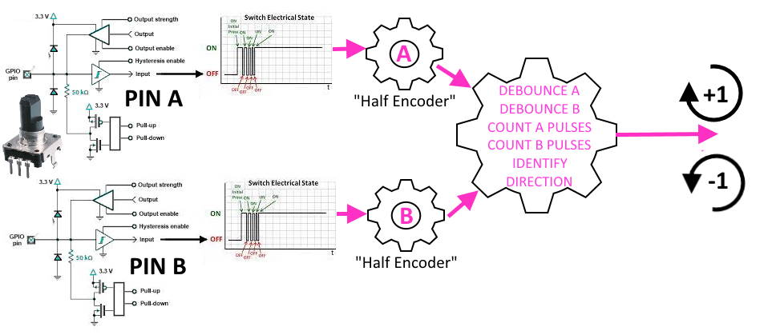
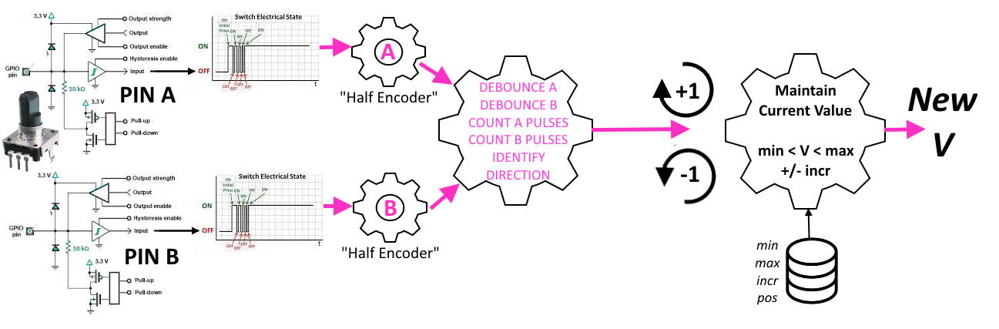

# GPIO Handling and "NODE-PINK" with rotary encoders

# Contents

* [Introduction](#introduction)
* [Graphical Example: debouncing](#an-example---debouncing-graphically)
* [Code Example: debouncing](#an-example---debouncing-in-code)
* [Essential further reading](#essential-further-reading)

---

# Introduction

Using rotary encoders can be daunting for beginners: they need two GPIO pins and are commonly managed with interrupts - which in themselves are a whole different can of worms that even experienced programmers often fear to open. Then there is the tricky quadrature encoding scheme of the two pins (usually called A and B) which needs to be translated into rotary motion in either a clockwise or anti-clockwise direction. All in all, its "non-trivial".

Furthermore there are dozens of quite different circuits for hardware debouncing and various opinions about which is best...in short, using Encoders can be difficult. But it doesn't need to be that way...

NODE-PINK solves the problem with two simple flows, either of which is declared in a single line of code. They require no external hardware components and perform both the debouncing and the quadrature decoding.

The simple encoder (`h4pEncoder`) then sends an `H4PE_EVENT` with `msg` of +1 every time the encoder clicks clockwise or -1 every time its clicks anti-clockwise, it's that simple.

The automatic encoder (`h4pEncoderAuto`) is a much cleverer beast, but just as easy to use. When you declare it you give it:

* A minimum value (default = 1)
* A maximum value (default = 100)
* An increment amount (default = 1)
* A percentage starting position (default = 50% , i.e. "centered")

Then whenever the user turns it, it sends an `H4PE_EVENT` with `msg` of whatever the current value just changed to. Using the above defaults and clicking once clockwise you get an `H4PE_EVENT` with `msg` = 51. And that's pretty much all there is to encoders in NODE-PINK!

## Graphically

### `h4pEncoder`



### `h4pEncoderAuto`



**N.B.** The user never has to know about or deal with the "half encoders" - they are included in the diagram for completeness and to aid understanding.

---

# Common Parameters

* `uint8_t pA` // pin A gpio number
* `uint8_t pB` // pin B gpio number
* `uint8_t` m // The mode as per Arduino's `pinMode`: either `INPUT` or `INPUT_PULLUP`
* `H4PM_SENSE` s // Whether `ACTIVE_HIGH` or `ACTIVE_LOW` 

---

# h4pEncoder

Manages a rotary encoder, including all necessary debouncing and decoding. You get an event `msg` of -1 for every anti-clockwise click or +1 for clockwise.

It also takes a binary parameter `sord` to tell it to operate in "Single" or "Dual" mode, which is explained below. The default is "Single" (and is probably best left that way!)

Pipeline:

Pin A `npROTARYDECODE{pA,pB,sord}` ->  `npPUBLISHVALUE`

Pin B `npPASSTHRU{pA}`  // simply "forwards" all transitions to the pinA handler

```cpp
h4pEncoder(uint8_t pA,uint8_t pB,uint8_t m,H4PM_SENSE s,bool sord=true);
```

[Example Sketch](../examples/01_GPIO_PIN_MACHINE/PM_13_Encoder/PM_13_Encoder.ino)

## Single vs Dual mode

In dual mode `H4PE_GPIO` events are sent on both the PinA and PinB pins: the user can decide which one to listen for. This maintains certain internal values accurately on PinB for purist purposes and may be leveraged in the future. Setting it to single is recommended, in which case you will only ever see `H4PE_GPIO` events on PinA and never any events at all on PinB. This is why for example the internal field sigE ("sigma Events") will not be correct for PinB - it will remain at zero, as will the delta value between events, and others...

None of this should be noticed by the user, nor make any real difference: it is included for the sake of completeness and to prevent erroneous support issues such as "PinB internal statistics aren't getting updated!!!" and saves me having to reply: "Well don't look at them then!".

---

# h4pEncoderAuto

Think of this as an "absolute" encoder or an `h4pEncoder` "on steroids". At creation time, you provide a minimum (`vMin`) and a maximum (`vMax`) value and an increment amount (`vInc`). By default the `h4pEncoderAuto` will be set to a starting value of the mid-point between `vMin` and `vMax`, but you can set it anywhere you like as a percentage (`vSet`) of the valid range between `vMin` and `vMax`.

Each time it is clicked in the clockwise direction it will add `vInc` to the current value, and subtract `vInc` when turned anticlockwise.

It has an additional parameter (`bool wrap`) which determines the action on reaching the "end-stops" of `vMin` or `vMax`. If `wrap` is `true` then the value "wraps round", ie < `vMin` becomes `vMax` and > `vMax` becomes `vMin`. If `wrap` is `false` then trying to rotate the value past the end-stop has no effect: it simply "stops dead" and can only be reversed.

Either `vMin` or `vMax`. may be negative: you could have `vMin` = -273 and `vMax` =-1

Pipeline: 

Pin A `npROTARYDECODE{pA,pB,true}`->`npLIMITER{this,vMin,vMax,vInc,vSet,wrap}`->`npVALUEDIFF`->`npPUBLISHVALUE`

Pin B `npPASSTHRU{pA}`  // simply "forwards" all transitions to the pinA handler

```cpp
h4pEncoderAuto(uint8_t pA,uint8_t pB,uint8_t m,H4PM_SENSE s,int vMin=0,int vMax=100,int vInc=1,int _vSet=50,bool wrap=false);
```

`h4pEncoderAuto` Also provides the following methods.

```cpp
void center(); // set value to 50% = (vmax - vmin) / 2
int getValue(); // return current value
void setPercent(int v) // set value to arbitrary percentage position between vmin and vmax
void setToMax(); // force to vmax ("fully clockwise")
void setToMin(){ // force to vmin ("fully clockwise")
void setValue(int v)// set arbitrary value: will be constrained such that vmin < v < vmax
```

[Example Sketch](../examples/01_GPIO_PIN_MACHINE/PM_14_EncoderAuto/PM_14_EncoderAuto.ino)

---

# Essential further reading:

* [GPIO/NODE-PINK: a logical approach](logphys.md)
* [GPIO/NODE-PINK: basic flows](basic.md)
* :building_construction: [GPIO/NODE-PINK: analog flows](analog.md)
* :building_construction: [GPIO/NODE-PINK: advanced techniques](nodepinkadv.md)

---

(c) 2021 Phil Bowles h4plugins@gmail.com

* [Youtube channel (instructional videos)](https://www.youtube.com/channel/UCYi-Ko76_3p9hBUtleZRY6g)
* [Facebook H4  Support / Discussion](https://www.facebook.com/groups/444344099599131/)
* [Facebook General ESP8266 / ESP32](https://www.facebook.com/groups/2125820374390340/)
* [Facebook ESP8266 Programming Questions](https://www.facebook.com/groups/esp8266questions/)
* [Facebook ESP Developers (moderator)](https://www.facebook.com/groups/ESP8266/)
* [Support me on Patreon](https://patreon.com/esparto)