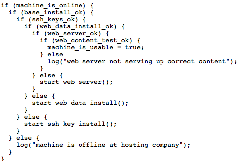

# Everything is an event: Listeners, Emitters and Handlers

:gem: Essential background for getting started with H4Plugins

---

# Contents

* [EVERYTHING is an event](#everything-is-an-event)
* [Anatomy of H4Plugins events](#the-anatomy-of-h4plugins-events)
* [Event handlers](#event-handlers)
* [Code structure](#code-structure)
    * ["One great big switch statement"](#one-great-big-switch-statement) 
    * [Avoiding the "flying ducks"](#avoiding-the-flying-ducks) :duck: 
                                                                :duck:
                                                                :duck:  
* [Event Listeners](#event-listeners)
* [Logging](#logging)
* [Event Emitters](#event-emitters)
* :door: Formal API Specifications
  * [H4P_EventListener](ears.md)
  * [H4P_SerialLogger](slog.md)
  * [H4P_LocalLogger](llog.md)
  * [H4P_MQTTLogger](mlog.md)
  * [H4P_RemoteLogger](rlog.md)
  * [H4P_EmitHeap](heap.md)
  * [H4P_EmitLoopCount](loops.md)
  * [H4P_EmitQ](eq.md)
  * [H4P_EmitTick](tick.md)

---

# EVERYTHING is an event

If you have used javascript, the following concepts should already by familiar to you, but read on to ensure you understand H4Plugins' use of the terminology. Similarly if you are familiar with MQTT, H4Plugins events are much like topics in the publish / subscribe model. If you know neither, then: Welcom to the wonderful world of *events*!

*Everything* you are going to deal with in H4Plugins starts out as an event. That's 99% true, but you will learn about the other 1% as you become more expert with the framework. You should know already from reading the [H4 documentation](https://github.com/philbowles/H4) why we *need* "Event-driven programming" - and hopefully that is why you are here, but what exactly *is* an event? 

In its broadest sense an event is something that happens in the real world, for example:

* User presses a button on a GPIO pin
* Alexa voice control sends a request
* Trying to access a remote server which "times out"
* A measured natural phenomenon changes, e.g. temperature, humidity

There can be many more, this is just to start us off with the concept of "things" occuring apparently
* a) at random
* b) beyond our control

that we need to be aware of and/or respond to.

These real world events are the "happenings" that H4 translates into a list of tasks in a queue. Sometimes however, things happen so fast that waiting for the next task can be too long: for these things we have H4Plugins events. They are used heavily by the GPIO system for example, where things need to be dealt with very rapidly. H4Plugins can also create its own internal events - these appear exactly the same as any other event and there is a single common interface for dealing with all events, no matter where they start from or how or who else is interested.

Your code tells H4Plugins which specifc type of events your are interested in and what to do when one happens. H4Plugins does all the "heavy lifting" and your code will look probably end up looking like ["one great big `switch` statement"](#code-structure-one-great-big-switch-staement) with short, simple sections of your own code reacting to those events.

# The anatomy of H4Plugins events

H4Plugins events have 3 pieces of information:

* The *type* of event ("what just happened?")
* Optionally, some data attached to the event ("is there any more information about it?")
* The "source" of the event ("where did it come from / what caused it?")

Dealing with these in reverse order:
## Event sources

Each plugin is a separate piece of code that runs as a "service" and has a short name associated with it, for example `wifi` or `mqtt`. For this reason it is often referred to generally as `svc`. You can (and should) read more about services here: [Common Command and Control: H4P_SerialCmd and Services](ccc.md). Generally speaking the source will be the short name of the plugin service that caused the event. One small warning though: some other sources that are *not* services will also cause events. Do not fall into the trap of assuming that the `svc` name identifies a *service* specifically, think of it just a convenient short id for whatever caused it.

For example, when dealing with events from GPIO pins, the source value in `svc` is the pin number. During startup before any service can possibly be running yet, it will be the imaginary service `h4p`. At the end of the day it is just a unique name for the event.

## Event messages

The message part of the event can contain any data, depending on the type of message. For example with GPIO it is the new value of the GPIO pin. Even though many events may send numeric values, the message type is always `std::string`. It is easy to call `atoi` to get an integer value if required. Where an event has nothing useful to add, the message will be an empty string, e.g. `msg==""` and `msg.size()==0` are both `true`

## Event types

| Event Name | Meaning | Msg contains | Note |
| :--- | :--- | :--- | :---: |
|H4PE_BOOT|System Start||1|
|H4PE_STAGE2|Sytem Start 2||1|
|H4PE_SERVICE|'svc' goes up/down|1=up, 0=down|1|
|H4PE_REBOOT|About to reboot||2|
|H4PE_FACTORY|About to factory reset||2|
|H4PE_SYSINFO|Important information|Arbitrary message||
|H4PE_SYSWARN|Possible problem - fix it|Arbitrary message||
|H4PE_SYSFATAL|System cannot continue|Arbitrary message|3|
|H4PE_HEAP|Heap has been measured|current size|4|
|H4PE_LOOPS|Loops/sec measured|current count|4|
|H4PE_Q|Q length has been measured|current size|4|
|H4PE_CMD|A command was received|The command||
|H4PE_UIADD|Add web UI item|item parameters|1|
|H4PE_UISYNC|Update web UI|item name|1|
|H4PE_UIMSG|Send message to web UI scrolling area|message|1|
|H4PE_HEARTBEAT|1-second "tick"|formatted uptime||
|H4PE_MSG|Log a message|arbitrary text||
|H4PE_SIGNAL|Flash pattern|timebase,pattern|5|
|H4PE_VIEWERS|Number of actual web users|0=no viewers,1=at least 1||
|H4PE_GPIO|Pin activity|depends on pin||
|H4PE_GVCHANGE|A global variable has changed|new value||
|H4PE_RTC|A valid NTP server has been contacted|clock time||
|H4PE_ALARM|An RTC based Alarm has just "gone off"||
|H4PE_PRESENCE|A named roaming device has joined/left the network|0=left, 1=joined||
|H4PE_UPNP|Used internally to detect UPNP roaming|device name|1|

Notes:
1. Internal use, for information only. Do not emit, listen out for etc...
2. Monitor these if you have resources to cleardown / erase
3. This is a radical "fail-safe" state: system will loop indefintely to prevent any GPIO activity.
4. For diagnostic / tuning purposes only
5. See [H4P_Signaller](h4fc.md)

As you can see, many of the events are for internal use only and you only need to be aware of them if you are writing your own plugin or doing some of the things discussed in [Advanced Topics](docs/advanced.md). Most users wil only need to react to:

* H4PE_GPIO
* H4PE_GVCHANGE
* H4PE_PRESENCE (if using that feature)

Once you are more advanced and start adding your own data to the web UI you will need to listen out for:

* H4PE_VIEWERS and possibly...
* H4PE_UISYNC

---

# Event handlers

An event handler is nothing more than a function that has the following prototype:

```cpp
void anyOldFunction(const string& svc,H4PE_TYPE t,const string& msg)
```

They usually come in one of three forms:

1. `h4pGlobalEventHandler` As its name implies it catches *all* events from all sources, if you want it is *must* be called exactly that and it can only be defined once anywhere in the whole of your code.
2. A lambda function built into a call to an event listener, or logger e.g. `H4P_EventListener` (see later)
3. A free-standing function that *you* write

Here is an excerpt from the example sketch [00_EverythingIsAnEvent](../examples/00_START_HERE/00_EverythingIsAnEvent/00_EverythingIsAnEvent.ino)

```cpp
void h4pGlobalEventHandler(const string& svc,H4PE_TYPE t,const string& msg){
  Serial.printf("Big Brother sees EVERYTHING %s %s %s\n",svc.data(),h4pGetEventName(t).data(),msg.data());
  switch(t){
    case H4PE_NOOP:
      Serial.printf("Used for testing: you will never see this\n");
      break;
    // None of the SYSx events can be turned off / compiled out
    case H4PE_SYSINFO:
      Serial.printf("Important system information:\n");
      break;
...
```

There is a danger here that more complex apps may start to make the handler become unwieldy but there are solutions for that which will be covered shortly.

***CAVEAT***

There is a limit to the things you can/should do in an event handler. For example, if you do something which causes the same event to occur again, you will cause an infinite loop like a snake eating its own tail...plus you should not do "too much" work, because you will be stopping the next function in the handler chain from getting notified of this event, which is greedy and selfish (and can break things!). How much is "too much" depends on your app, but keep it small, self-contained and be careful what you call.

If you have ever used interrupts or are familiar with context switches, think of the event handler the same way: while it is *far* more forgiving, you do need to take care. Imagine you are on a low stack iniside a switched context...If you don't understand any of that, then take home this golden rule:

***Do as little as possible and get out fast.***

There is an easy solution if you *do* need to do "some work" use [H4](https://github.com/philbowles/H4)'s `queueFunction` to "offload" that work to a full task the next main loop cycle, which can safely do pretty much anything it wants to.

---
# Code structure

## No `setup` or `loop` function

Hopefully you should be starting to understand why there is no `loop` function. [H4](https://github.com/philbowles/H4) controls "all that stuff" - that is its only job. It listens out for all possible events and then passes through to your code the events that you need to listen for and/or react to.

The main body of your code then is going to be an event handler, telling H4Plugins which events you are interested in.
## Simple inline logical blocks

Broadly speaking the structure of all your apps will now look like:

```cpp
//
// 1. MANDATORY HEADERS
//
#include<H4Plugins.h>
H4_USE_PLUGINS(115200,H4_Q_CAPACITY,false)
//
// 2. LIST OF PLUGINS REQUIRED
//
H4P_blah 1 ...
H4P_blah 2 ...
H4P_blah 3 ...
//
// 3. [OPTIONAL] Declarations of other required H4Plugins class objects such as:
//   (a) GPIO pin functions
//   (b) Roaming devices for presence detection
// e.g.
//
h4pOutput builtinLED(LED_BUILTIN,... etc
h4pDebounced pinzero(0,INPUT_PULLUP,... etc
...
h4pRoamingH4 clok("ntpclock"... 
h4pRoamingDotLocal box("box"...
h4pRoamingIP htc("iPhone"...
//
// 4. [OPTIONAL] Any one-time-only setup
//
void h4setup{ /* your code here */ }
//
// 5. [OPTIONAL] (but almost always present) Your handler
// for all the events your code needs to manage, which will probably
// look like "one great big switch statement"
//
```

## General advice

Here is a simple truism: If your app's code structure *doesn't* look like the above then two things follow:

1. You are using the library incorrectly, expect plenty of trouble
2. Because of the above, don't expect much sympathetic support.

Use the library the way it was designed, look at the 80+ examples, copy / steal / repurpose them for your own needs. Copy theri structure / style. The more *your* code looks like one of the exmples, the more likely it is to work cotrrectly.

Don't try to "hang on" to old styles / techniques merely for nostalgic reasons: there are plenty of *other* reasons why H4Plugins *doesn't* work that way. Embrace "The H4Plugins way" and don't try to fight it. Do it "The H4 way, not *your* way", you will thank me eventually but before that time comes, repeat after me: *"I am not in charge of the code. H4 runs it for me. I do not decide the order of events, the world does that and H4 feeds them to me in an orderly manner."*

For that very reason, if you write code tha expects / predicts / relies on things happening in a specific order, it will almost certainly break. If not today then some time in the future when the planets don't accidentally happen to line up how you like them to. Stop thinking sequentially and don't write sequential code - it has *never* been the way the real messy world works. Write event-driven code that functions irrespective of the order of events, because...*"I am not in charge of the code. H4 runs it for me. I do not decide the order of events, the world does that and H4 feeds them to me in an orderly manner."*

If you *still* can't get things to work:

1. Read the relevant sections of the API documentation for the plugin
2. Ask a question in the support group (with as much information as possible)
3. If 1 & 2 don't work, don't try tricks / workarounds etc, just ask for new features to be added!

## "One great big `switch` statement"

Way back in simpler times, it used to be fashionable to have wall plaques in the form of flying ducks, often over the fireplace or an a "feature wall". ***DO NOT ASK ME WHY!*** The concept has soaked into the human pysche and despite becoming the height of kistch, it has found its final resting place in programming terminology to denote (usualy deprecatingly) code that is deeply nested.

Compare and contrast:

a) 1950s cheezy kitsch


b) Real ducks:


c) Modern nested code



For me, c) is far easier to understand than a) but moving on...

### A fictitious example

Imagine you have 3 GPIO inputs and 3 global variables that might change and you want to know when some service shuts down or starts up

Once we get to handling `H4PE_GPIO` events, your code will need to look something like:

```cpp
void h4pGlobalEventHandler(const string& svc,H4PE_TYPE t,const string& msg){
  Serial.printf("Big Brother sees EVERYTHING %s %s %s\n",svc.data(),h4pGetEventName(t).data(),msg.data());
  switch(t){
...
    case H4PE_GPIO:
      Serial.printf("Something went 'ping!'\n");
      auto pin=atoi(svc.data()); // convert the svc field to the pin number that went 'ping'
      auto value=atoi(msg.data()); // convert the msg field to the pin value, usually 1 or 0
      // now do the three different things depending on which pin whent 'ping'
      switch(pin){
        case MYPIN_A:
          // handle pin A event 
          break;
        case MYPIN_B:
          // handle pin B event 
          break;
        case MYPIN_C:
          // handle pin C event 
          break;
        default
          // handle some terrible disaster when unknown pin comes through
          break;
      }
      break;
...
```

Next you need to do something similar for the services, for example:

```cpp
  Serial.printf("Big Brother sees EVERYTHING %s %s %s\n",svc.data(),h4pGetEventName(t).data(),msg.data());
  switch(t){
...
    case H4PE_GPIO:
...
      switch(pin){
        case MYPIN_A:
...
      }
      break;
    case H4PE_SERVICE:
      auto updown=atoi(msg.data());
      if(svc=="wifi"){
        if(updown) Serial.println("wifi up :)");
        else Serial.println("wifi down :(");
      }
      else {
        if(svc=="mqtt") {
          if(updown) Serial.println("mqtt up :)");
          else Serial.println("mqtt down :(");
        }
      }
...
```

We don't need to see the code for handling changes to your 3 global variables to realise that pretty soon this essential structure could get "out of hand" - you can already see the ducks forming up on the leader...

For this reason a series of macros known as "ADAPTERS" and "CONNECTORS" exist to help clean up and lean up that potential "one great big `switch` statement" into smaller inline function chunks.

## Avoiding the "Flying Ducks"
### Adapters

In H4Plugins-speak an ADAPTER is a macro that replaces one or more of the `case` statements in an event handler and creates code to pass the event to a simple external function that lives "inline" with the main code.

For example:

```cpp
void h4pGlobalEventHandler(const string& svc,H4PE_TYPE t,const string& msg){
    switch(t){
      ...
        case H4PE_SERVICE:
            H4P_SERVICE_ADAPTER(Mqtt);
            break;
    }
}
```

expects that somewhere else in your code you have:

```cpp
void onMqttConnect(){ /* your code */ }
void onMqttDisconnect(){  /* your code */  }
````

You can add more lines thus:

```cpp
...
  switch(t){
...
    case H4PE_SERVICE:
      H4P_SERVICE_ADAPTER(WIFI);
      H4P_SERVICE_ADAPTER(Mqtt);
      break;
  }   
}
...
void onWIFIConnect(){ /* your code */ }
void onWIFIDisconnect(){ /* your code */ }
...
```

ADAPTERS then, help us to avoid too many flying ducks by "flattening out" the "one great big switch statement" and allowing us to create bite-sized nuggets inline with the main flow, which is *a lot* easier to read and maintain. 

The full list is:

* H4P_DEFAULT_SYSTEM_HANDLER
* H4P_SERVICE_ADAPTER(s)
* H4P_FUNCTION_ADAPTER(e)
* H4P_FUNCTION_ADAPTER_II(e)
* H4P_FUNCTION_ADAPTER_SI(e)
* H4P_FUNCTION_ADAPTER_VOID(e)
* H4P_FUNCTION_ADAPTER_GPIO
* H4P_FUNCTION_ADAPTER_PRESENCE

Let's rip through the rest of them...

#### H4P_DEFAULT_SYSTEM_HANDLER

No parameters. Provides default behaviours for:

* H4PE_SYSINFO - simple printf to monitor
* H4PE_WARN - printf to monitor in a big box, If I could flash it red, I would
* H4PE_SYSFATAL - as for H4PE_WARN but also then performs the following (controversial?)
action: Enters an infinite loop where it flashes the builtin LED at a very rapid "panicky" rate. ***IT WILL NOT REBOOT THE SKETCH***

For some (perhaps dogmatic or shortsighted ?) folk that's a controverial action, but there are two points to be made:

1) Its optional: if you don't like it, don't use it.
2) It can be far more "failsafe" than the "standard" option of an infinite "boot loop"

Imagine the "thing" your app does is run a pump that keeps your prize-wining multi-thousand dollar Koi alive. Would you rather the pump failed in the "fully open" or "fully" closed postion? "Fully open" is going to cost you a lot of money and pain: if for example on reboot the pump starts even thought the inlet valve code has a bug that causes a fatal "boot loop" before it can open the inlet...maybe its physically jammed? ...

Then over the weekend while you are away, the pump is going to empty your pond a cup at a time every time it goes "squirt! fail! reboot!, squirt! fail! reboot!". With the "infinite loop" method the pump never gets the chance to restart: the fish survive.

On the other hand, if it's running an iron lung, I'd rather get a short gasp every few seconds than never another breath, so its absolutely ***not*** "one-size-fits-all", it depends entirely on you and your app. At least the option is there if you need it. I recommend having it in always during the early stages of development then taking it out once everything starts working.

```cpp
void h4pGlobalEventHandler(const string& svc,H4PE_TYPE t,const string& msg){
  //Serial.printf("Big Brother sees EVERYTHING %s %s %s\n",CSTR(svc),CSTR(h4pGetEventName(t)),CSTR(msg));
  switch(t){
    H4P_DEFAULT_SYSTEM_HANDLER
    case H4PE_xxx:
...
      break;
    case H4PE_yyy:
...
      break;
...
  }   
}
```

#### H4P_SERVICE_ADAPTER(s)

See above for examples

#### H4P_FUNCTION_ADAPTER(e)

Where `e` is the last part of the event so you don't have to keep typing `H4PE_...`

All events have the two `std::string`s named `svc` and `msg`. This adapter just "offloads" the event to a function expecting two `std::string` references, e.g. `H4PE_MSG`

This variant expects a function of the form:

```cpp
void onMSG(std::string& svc, std::string& msg){ Serial.printf("%s says %s\n",svc.data(),msg.data()); }
```

#### H4P_FUNCTION_ADAPTER_VOID(e)

Is only useful for events that carry no meaningful data and thus whose handlers expect no parameters, for example `H4PE_RTC` requiring something simliar to:

```cpp
...
        H4P_FUNCTION_ADAPTER_VOID(RTC)
...
void onRTC(){ Serial.printf("Nothing much I can do about it...\n"); }
```

#### H4P_FUNCTION_ADAPTER_II(e)

While all events have the two `std::string`s, some of them will only ever have numeric values in the them which you will generally need to convert to `int` or `uint32_t` every time. For example `H4PE_GPIO` has a numeric pin number in `svc` and a numeric value in `msg`.

Ideally you'd like an "offloaded" function to just receive the two integer values:

```cpp
...
void h4pGlobalEventHandler(const string& svc,H4PE_TYPE t,const string& msg){
  switch(t){
    H4P_FUNCTION_ADAPTER_II(GPIO);
  }   
}
...

void onGPIO(int pin, int value){ /* your code */ }
```

In this specific case, ther's an even simpler version: `H4P_FUNCTION_ADAPTER_GPIO`

#### H4P_FUNCTION_ADAPTER_SI(e)

Expects an offloaded handler having `std::string` for `svc` and an `int` for `msg` for example `H4PE_PRESENCE` where `svc` is the roaming device's name/id and `msg` is a simple `bool` denoting enter / leave.

Again in the actual case of `H4PE_PRESENCE` there's a neater form: `H4P_FUNCTION_ADAPTER_PRESENCE`


### CONNECTORS

A CONNECTOR is a specific type of `H4PE_GPIO` handler. 

#### H4P_ONOFF_CONNECTOR(e) 

"Pipes" the numeric value in `msg` to the default ON/OFF device. For example if you had a device with a [H4P_BinarySwitch](swings.md) and you used the following connector inside the main switch statement, then anything joing the network would turn on the default switch and anything leaving would turn it off, without any additional code.

```cpp
  ...
  H4P_ONOFF_CONNECTOR(PRESENCE)
  ...
```

#### H4P_ONOFF_CONNECTOR_INVERTED(e)

See above, but inverts the `bool` value in `msg` before piping it. In the same scenario, the action of the device *leaving* the network turns the [H4P_BinarySwitch](swings.md) ON while *joining* the network turns it OFF. Think "auto-activating alarm" with your personal phone as the roaming device that fires the `H4PE_PRESENCE` event. Your alarm goes ON automatically when you leave home, and switches off automatically just before you re-enter.

#### H4P_TACT_BUTTON_CONNECTOR(x)

This and the final CONNECTOR `H4P_LATCH_BUTTON_CONNECTOR(x)` are buth used to manage user button effects in the webUI which is getting too far ahead: they will be explained in detail later in [WiFi and the web UI](webui.md)

#### H4P_LATCH_BUTTON_CONNECTOR(x)

See above.

---
# Event Listeners

We have seen that an Event Listener is *any* piece of code that registers a handler for a known event and provides a callback function of the form:

```cpp
void MyVeryOwnEventHandler(const string& svc,H4PE_TYPE t,const string& msg){ ... do some interesting stuff }
```

All plugins do this automatically, so all plugins are - by definition - Event Listeners.

## Handling your own events

***IMPORTANT CAVEAT:***

One of the "gotchas" that newcomers to ESP8266 / ESP32 suffer especially if they are moving from say PIC or Arduino or STM32 programming is that *yours is not the only code running*. That's the whole reason you are here, because to get muliple things happening at the same time you have to cope with that and thats why H4 and H4Plugins were written, to make that easy for you.

BUT..."easy" doesn't mean "invisible": you still have to be aware that there is a lot of other code running and it too emits and listens for events. This raises a very a important point:

***All handlers, incuding the ones you write get called for ALL events of that type, whether you sent them or not***. 
(All events are "global" in effect)

This means that you may well have to exmine both the `svc` and/or `msg` fields to decide if it's "one of yours" before acting on any particular event.

With this in mind, if you are interested in a single event, there is a simple function you can call:

```cpp
void h4pOnEvent(H4PE_TYPE t,H4P_FN_USEREVENT f);
```

Names a function `f` (or defines a lambda) of type `H4P_FN_USEREVENT` (which just means it is a `void` function with a `std::string` parameter) to handle the specific event type `t`. For example:

```cpp
...
void sayGoodbye(const string& msg){ // msg is unused in H4PE_FACTORY
    Serial.println("Morituri te salutant"); // Latin for *"We who are about to die, salute you"*
}
...
h4pOnEvent(H4PE_FACTORY,sayGoodbye);
```

If more than one event type needs to be monitored, you need an [H4P_EventListener](ears.md), but before that you need to know how to combine events.

## Handling Multiple Events

### Combining Events

Multiple Events types are specified at the same time by packing them all into a bit-mask. Naming several events then uses the C/C++ language bitwise-or operator: `|` (vertical bar)

```cpp
uint32_t myMultipleEventBitmask = H4PE_REBOOT | H4PE_FACTORY;
...
// myEventHandler will get called if either H4PE_REBOOT OR H4PE_FACTORY occurs
H4P_EventListener ears1(myMultipleEventBitmask,MyVeryOwnEventHandler); 
```

### Excluding Events

Again using standard C/C++ language bitwise logic operators, this time `&` and `~` (complement) we can exclude certain events. 
Saying `H4PE_ALL &~ H4PE_HEARTBEAT` will handle everything *except* `H4PE_HEARTBEAT`. The `&~` should be read as "and not"

---
# Logging

A Logger is simply an event listener for some event type(s) and then does something useful with them, usually showing, saving, relaying, or forwarding them somewhere else.

For example, the ready-made loggers that come with H4Plugins:

* [H4P_SerialLogger](slog.md) displays the event information on the Serial Monitor.
* [H4P_LocalLogger](llog.md) saves the events to a `log.csv` file in Flash FS
* [H4P_MQTTLogger](mlog.md) publishes the event with a user-chosen topic name to the MQTT Server.
* [H4P_RemoteLogger](rlog.md) does an http POST of the event data to a remote server somewhere "in the cloud"
  
**N.B.** See [MySQL Logger](https://github.com/philbowles/mysqlrest) Github repo for a NodeJS / express webserver you can run to receive the output of [H4P_RemoteLogger](rlog.md) and save it to MySQL database.

### Creating Your own logger

Writing your own logger is extremely easy. As mentioned above, all you need to do is implement an event handling function. There is a [Custom Logger example sketch](../examples/LOGGING/H4P_CustomLogger/H4P_CustomLogger.ino) but it is *so* simple, we will look at it in detail here.

First is the custom logger class. We name it "lumberjack" for a bit of fun:

```cpp
class myLogger: public H4Service {
        void _handleEvent(const string& svc,H4PE_TYPE t,const string& msg) override {
            uint32_t msgvalue=atoi(msg.c_str());
            if(msgvalue%2) Serial.printf("That's odd! Type=%s from %s msg=%s\n",h4pGetEventName(t).c_str(),svc.c_str(),msg.c_str());
        }
    public:
        myLogger(uint32_t filter=H4PE_ALL): H4Service("lumberjack",filter){}
};
```

You could omit the filter parameter and "hard-code" a type or types that you register with the underlying H4Service like this:

```cpp
    public:
        myLogger(): H4Service("lumberjack",H4PE_USER | H4PE_MSG){}
```

But its far more flexible to just pass through whatever the user decides when they instantiate your logger

The event handler is very simple (as well as unusual and not very useful!). It expects the message to contain an integer value and it ignores everything except the odd values.

This means that unless you can guarantee that any event you listen to contains a single integer in its message - which usually you can't - then you need to be very careful!

If we restrict ourselves in the app to emitting H4PE_MSG messages with an integer in the message, then our example will work, but only as long as no other code sends H4PE_MSG with text values.

## A generic Listener

While the above information is good to know, there's a shortcut which does 90% of it for you, the [H4P_EventListener](ears.md) plugin. All you need to do is slot in the actual "meat" of the function to be called whenever any registered event(s) occur(s) 

```cpp
void myHandler(const string& svc,H4PE_TYPE t,const string& msg){ ...do something wonderful...};
...
H4P_EventListener bigBrother( ...events you want ... ,myHandler);
```

The simplest of example of this is the predefined [H4P_SerialLogger](slog.md) where the "...do something wonderful..." code simply prints the message with `Serial.printf`

## h4pGlobalEventHandler: The Global Listener

We have already enclountered this but it is *so* important and helpful during testing and development (and pretty intrusive and annoying at all other times) that I mention it again.

You   optionally provide a function called `h4pGlobalEventHandler`. If you do then *every single event* emitted by *all* code in the system will arrive here, so be prepared. There is no filter, it's *global*, hence the name. You get *everything* whether you want it or not. Probably mostly "not".

```cpp
void h4pGlobalEventHandler(const std::string& svc,H4PE_TYPE t,const std::string& msg){
  Serial.printf("Big Brother sees EVERYTHING %s %s %s\n",svc.c_str(),h4pGetEventName(t).c_str(),msg.c_str());
}
```

---
# Event Emitters

So far everything has been about Listening for events, but how do we actually make them happen ourselves? Before we continue, it has to be stressed that ***unless you have declared a listener...*** of some kind before doing any of what follows, ***...you will see nothing***! As a minimum, the [H4P_SerialLogger](slog.md) is suggested.

The most fundamental method is to call:

```cpp
void h4psysevent(const string& svc,H4PE_TYPE t,const std::string& fmt, Args... args);
```

But this requires you to know...

* A valid `svc` name or value
* The content and format (if any) of the message expected by the specific H4PE_TYPE
  
... so there are some shortcuts and easier ways

## Simple message logging

First there is

```cpp
void h4pUserEvent(const char* format,...);
```

Which emits an event of type `H4PE_MSG` with a message made up from `printf`-style format string and optional list of parameters, e.g. `h4pUserEvent("Something %s interesting happened","mildly");` - basically anything you want.

More importantly it can be "compiled out"

If you edit [config_plugins.h](../src/config_plugins.h) and set:

```cpp
#define H4P_LOG_MESSAGES      0
```

Then all `h4pUserEvent` calls in your code effecitvely disappear, making you code leaner, meaner and a lot less chatty. This is great for "production" but not very helpful while testing and/or debugging, so until you are 100% happy with your code, leave it set to 1.

## Simple event emitting

You should restrict your emissions to `H4PE_MSG` since this can (usually) do no harm. Emitting any other event can cause bad things to happen if you do it at the wrong time or get the message contents wrong.
## "Standard" emitters

H4Plugins comes with some pre-defined event emitters which are useful during testing or debugging:

| Plugin | Event | Msg |Note|
| :--- | :--- | :--- | :---: |
|[H4P_EmitHeap](heap.md)|H4PE_HEAP|amount of free heap||
|[H4P_EmitLoopCount](loops)|H4PE_LOOPS|Loops per second|1|
|[H4P_EmitQ](eq.md)|H4PE_Q|Length of H4 Queue||
|[H4P_EmitTick](tick.md)|H4PE_HEARTBEAT|Integer number of seconds uptime||

Notes:
1. May require reconfiguration of [H4](https://github.com/philbowles/H4) 

---

(c) 2021 Phil Bowles h4plugins@gmail.com

* [Youtube channel (instructional videos)](https://www.youtube.com/channel/UCYi-Ko76_3p9hBUtleZRY6g)
* [Facebook H4  Support / Discussion](https://www.facebook.com/groups/444344099599131/)
* [Facebook General ESP8266 / ESP32](https://www.facebook.com/groups/2125820374390340/)
* [Facebook ESP8266 Programming Questions](https://www.facebook.com/groups/esp8266questions/)
* [Facebook ESP Developers (moderator)](https://www.facebook.com/groups/ESP8266/)
* [Support me on Patreon](https://patreon.com/es