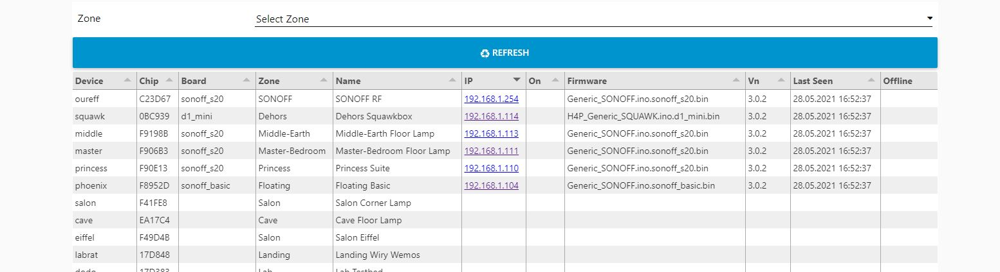
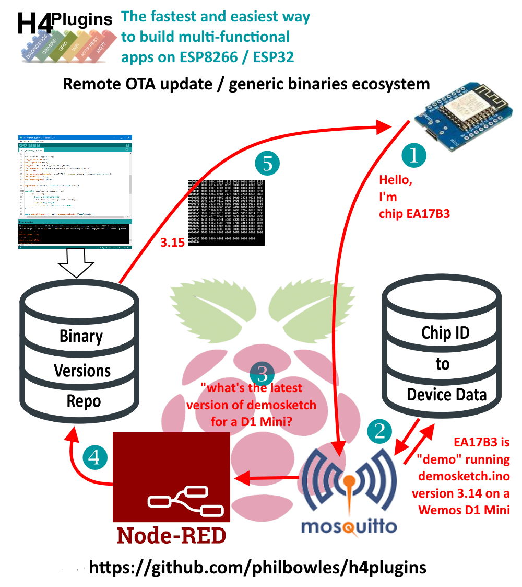
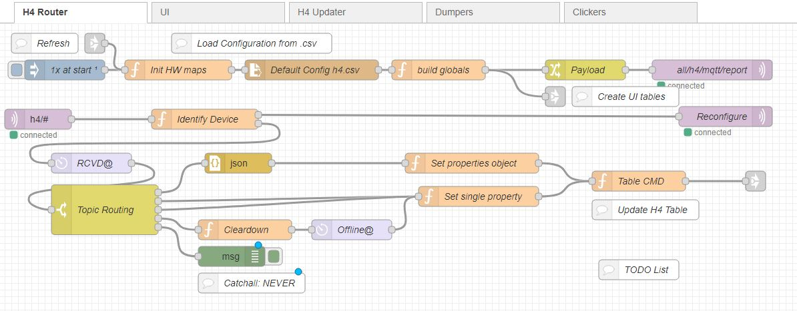

# Generic Binaries

:gem: Essential background for deploying/updating binaries **O**ver-**T**he-**A**ir (OTA) including how to write a binary for use when [Running a remote update server](rusrv.md)

Users may also find this Youtube video helpful, look for the red label "Expert" series [1. Running a remote update server on Nide-RED](https://youtu.be/zNjafa-4QEw)
helpful

---

# Contents

* [Introduction](#introduction)
* [Managing generic binaries](#managing-generic-binaries)
* [Writing a generic binary](#writing-a-generic-binary)
* [IMPORTANT IMPLICATIONS](#important-implications)
* [A "sneaky" way](#a-sneaky-way)

---

# Introduction

OTA updating has been a feature of the ESP8266 and '32 platforms from their introduction. Most users will have come across it as an alternative to a physical wired USB->UART connection when uploading a new sketch.

Once a user has a body of devices deployed to various physical locations around the home, updating them all starts to become tedious and impractical unless OTA is used, especially if devices have been installed in difficult locations (or impossible, i.e. behind a wall) .

Next, many users have a "favourite" type of device that they will have many examples of, meaning that one piece of code can be deployed to all those devices.

In the world of H4Plugins, all net devices have a simple identifying name, assigned by the user. All commands and MQTT control messages reference this name so that the user can control each device individually and this then begs the question of how does that name get into the device?

Obviously it cannot be compiled into the binary if the exact same binary is to be deployed to many different devices, each requiring it own name! For the sake of what follows, let us assume that a user has 10x Wemos D1 minis and 10x nodeMCUs deployed around the home and property and that they all have the same function and can be uploaded with the same source code.

# Managing generic binaries

The are a few of solutions to the dilemma, for example

1. Physically retrieve each device, bring it to the computer, edit source, recompile upload over USB - Do I really need to continue with this one?

2. Edit the individual name into the source, compile and OTA to each specific device.

This approach has a number of problems as the number of devices grows. The first essential is for the user to create and maintain a mapping of IP addresses to device names (and implictly then, locations). As the number of devices rises, so does the complexity and tedium of that task, with increasing risk or error.

Secondly, using our fictitious example the user has to edit and compile the code 10 times for D1 mini, and another 10x for nodeMCU. 20 edit and uploads: time-consuming, tedious and error-prone. Now just imagine 50 devices or 100 it becomes totally impractical.

3. Code the app so that it goes into AP when it recognises new OTA firmware. Then 20 times over, with the IP/Location map in hand, connect to each hotsport, re-enter the device name. At least *this* method has each action identical...

## A (much) better way

There has to be a better way and there is. By the time we finish explaining it you may better understand what some folk see as "quirks" or "oddities" of the H4Plugins "ecosystem" but in fact are specific and carefully designed features to enable mass remote deployment and automatic OTA updates. Their ultimate goal is something like this on Node-RED's dashboard, and the ability to update all devices by the simple act of dropping the latest binary onto remote update server:




What we need is a device that has some unique value that can be tied to / associated with its device name *somehow*, then we could could cut out the device name editing step, and only need 2x compiles, 1 for D1 minis, 1 for nodeMCUs. We would still need 20 uploads, though, so its *better*, but still not *good*.

Now think about voice control, Alexa usually requires a more "friendly" name (often a longer one) for example: "bedroom corner lamp" rather than `d1mini22` or `nodemcu_17` so we need to have the unique id mapped to a small table of data with at least device name and Alexa-friendly name.

The first part is easy: every chip has a unique "chip ID" burned into it at the factory. It is the *only* thing about each chip that is unique that you can easily identify, so *must* form the basis of any mapping as we are discussing. The second part of the task then is the "*somehow*" - where do we hold the little data table of device names, indexed by `chipID` ?

## Where does the unique data live?

ESP8266 is a tiny MCU. It does not run any databases easily...The obvious answer is that each device could have a copy of, say a simple flat .csv file in SPIFFS. This is easily doable, easily manageable in code and wouldn't take too much space out of precious SPIFFS. The startup code would load the file, find the line that matched its own `chipID`, read the values and configure itself.

As long as the user remembers to add any new device to the file, it should work, but we still need a lot of manual intervention.

Another way of doing it is to hold the data on a central server, get the device to connect intially with a random name (hey, why not use the  `chipID` ? ), contact the server, retrieve its own data by key, then reconfigure itself and reconnect with its "true" identity.

This way, the data only needs to live in once place (always best to prevent errors) and "just works" once that configuration code runs. But it is "a bit of a faff" and a lot of network activity at startup *and* we need a central server. And *still* we have to get that code into the device in the first place.

What we are talking ourselves into is code that will autoconfigure itself *once* and then remember those values for all subsequent reboots. That can be done. Then we need a way for the code to automatically update itself to the latest version without us having to recompile 20 times. That can also be done. It needs somewhere on the network for that new code to "live" from which each device can then read the latest version in over OTA, overwrite itself then restart.

## We NEED* a central server

That last feature is known as "Remote Update". it's a feature of the ESP platform, and setting up your own remote update server is described here [Running a remote update server](rusrv.md).

In summary then , to make this easy and automatic, we *need* a central server - there is no way around that. It makes sense then to also store the `chipID` database on the same server. It makes even better sense to have a really simple method of managing the whole process and there is no better tool for doing that than [Node-RED](http://nodered.org) in conjuntion with an MQTT server.

*Or DO we? there is a ["sneaky" way] of doing it which we will discuss later

## The final picture

The whole ecosystem then looks something like this:



Once this is in place, the update process comes down to:

1. Compile a version for each MCU type (2 in our example)
2. Copy new binary to remote update repo version+1
3. From any mqtt client, send `all/rupd/fw`

And all devices will automatically update themselves.

---

# Writing a generic binary

Let's look at the code of [Generic Sonoff](../examples/XTRAS/Generic_SONOFF/Generic_SONOFF.ino). The hardware and functionality are not relevant for this discussion.

## What CANNOT be configured at boot-time

The MQTT server url *must* be compiled into the source, since *this* is where the config details come from, but see also [a "sneaky" way](#a-sneaky-way).

## What CAN be configured at boot-time

* device name
* upnp friendly name
* remote update url
* any system variable *for which documentation exists* and whose effects are fully understood, e.g. `autoOff=30000`
* any user-defined global variable you choose e.g. `mylocation=Garden Shed`

## Code example

```cpp
#include<H4Plugins.h>
H4_USE_PLUGINS(0,20,true) // Serial baud rate, Q size, SerialCmd autostop

#define RELAY_BUILTIN 12
#define BUTTON_BUILTIN 0

H4P_WiFi wiffy("XXXXXXXX","XXXXXXXX"); // <---- NOTE THE ABSENCE OF predefined device name
H4P_AsyncMQTT cutie("http://192.168.1.4:1883"); // will default to <router IP>:1883
H4P_BinarySwitch bs(RELAY_BUILTIN,ACTIVE_HIGH);
H4P_UPNPServer h4upnp; // <---- NOTE THE ABSENCE OF predefined "friendly name"
h4pMultifunctionButton h4mfb(BUTTON_BUILTIN,INPUT,ACTIVE_LOW,15);
H4P_RemoteUpdate h4ru; // <---- NOTE THE ABSENCE OF predefined remote url
```

The above code will deploy to any device of the correct type. We will assume its chipID is `123456`, Its initial unique identifiers will be:

* device: "H4-123456"
* friendly name: "H4 device 123456"
* remote url: ""

And it will have subscribed to the MQTT topic `123456/#`.

Seeing these type of IDs on your network means there is a device that has not yet been configured.

## The configuration mechanism

We have already seen this in [H4P_WiFi](h4wifi.md)

* `h4/config` (change value of on or more global variables* (see below)) 

*config payload:

For a single variable the payload should be name=value. You may also update several variables at a time by separating those name=value pairs with commas, e.g.

```cpp
h4/config/myvar=42
h4/config/myvar=666,life=42,firmware=h4plugins
```

When your central controller (usually Node-RED) 'sees' a message from a device whose name is `H4-*` it strips out the chipID, looks up the data store for the relevant values and then publishes something like:

`123456/h4/config/device=yourdevicename,name=the name alexa calls me,rupd=http://my.r.u.srv/update`

The device then changes its internal global values and reboots, coming back up intact and fully configured.

The author uses a simple `.csv` file...:

```
F41FE8,salon,Salon Corner Lamp
EA17C4,cave,Cave Floor Lamp
F49D4B,eiffel,Salon Eiffel
F8952D,phoenix,Floating Basic
...
```

...and a Node-RED flow whose scope is well beyond this document, but for reference:




## Surviving reboots

Globals are saved to persistent storage and the stored values are preferred on subsequent boots. This way, the configuration handshake process only occurs *once* when the device is "virgin"

## Surviving a Factory Reset

You can't. One of the main functions of "factory reset" is to erase all globals and return the device to as close as possible to virgin status. (It deliberately does *not* erase the SPIFFS / FS static webUI files, to save you having to reload them every time)

The very point of of the exercise is to force the device to re-read its configuration details, especially if they have changed.

---

# IMPORTANT IMPLICATIONS

The apparently innocent phrase above *"the stored values are preferred"* has some very important implications / side effects. For reasons *still* unknown to the author, some people find these hard to "get their heads around" which results in a disproportionate amount of "issues" or "bug reports" which are neither and result in a repsonse of **R.T.F.M**! What follows is *the* bit of the **F.M.** you need to **R.**, so that you never invoke the author's wrath by whining that *"my device isn't coming up with the right name"*

If you use the rules above and *never* specify a device name then your device wil only ever be seen as `H4-xxxxxx` when it is "virgin" or the value you set with `h4/config/device=blah` for ever after. If you factory reset it it, it will revert to `H4-xxxxxx`.

## The Golden Rules

H4Plugins' device naming preference order operates as follows: (the same rules apply for *any* global variable)

### Rule 1. 

If these is a global variable device name, ***use it***

### Rule 2. 

Otherwise, if there is a compile-time name, ***use it***

### Rule 3. 

When all else has failed, use `H4-< chip ID >` ( `H4-123456` in our currrent example)

## Test your knowledge with a Quiz

IF you choose some bastardised hybrid sytem where you *do* have a compiled-in name but you still insist on changing it at some future point with `h4/config/device=blah` or autoconfiguring it anyway, well that's when the "fun" starts.

Imagine the following sequence of events assuming our chipID of `123456` on a *brand new virgin chip* :

1. You change the code in the above example to say:
   
```cpp
H4P_WiFi wiffy("XXXXXXXX","XXXXXXXX","first");
```

1. After its boots as `first`, you send  `h4/config/device=second` 

### Question 1

What will the device name be when the new device reboots?

**A:** `H4-123456`

**B:** `first`

**C:** `second`

**D:** None of the above

The correct answer is **C** because this overwrites with the *new* value any previous global value that device held, and Rule 1 applies on reboot. I'm pretty confident this is what most people would expect.

3. Now, you factory reset the device.

### Question 2

What will the device name be when the new device starts?

**A:** `H4-123456`

**B:** `first`

**C:** `second`

**D:** None of the above

The correct answer is **B** if you didn't get this right, go back to the beginning and read it again.

4. You now recompile the program and "change its name" to "third" like so:

```cpp
H4P_WiFi wiffy("XXXXXXXX","XXXXXXXX","third");
```

### Question 3

What will the device name be when the new device first runs after the upload?

**A:** `H4-123456`

**B:** `third`

**C:** `first`

**D:** None of the above

If you said **B** then you are the sort of person who gets the **RTFM** response, so go back to the beginning and read the rules again. The correct answer is **C** because on reboot there is a global variable from the time when it started as `first` and so Rule 1 applies. Unless you do an "erase all flash" compile (which is the same as a factory reset) then any previoulsy saved name *will be preferred* 

For a bonus point, how would you get the device to be call itself `third` ? A point to all those who said: "Factory reset it"

## The Golden Rules 2

* If you change the name of device in the source, PERFORM A FACTORY RESET
* If add the name of device in the source where none existed before, PERFORM A FACTORY RESET
* If remove the name of a device to turn a sketch into a "generic", PERFORM A FACTORY RESET
* If you are at all confused about your own device name, PERFORM A FACTORY RESET
* Before even *thinking* of raising an issue / bug report related to device naming
  * a) PERFORM A FACTORY RESET
  * b) Read the Golden rules for name preference
  * c) Forget about raising the issue report.

---

# A "sneaky" way

There is another way to get data to the chip, but it is not recommended as it requires some low-level "hacking" and has not been fully tested although it *ought* to werk, *in theory*. It is included here merely for completeness and the true spirit of open source. You are on your own!

Globals are stored in flash file named `/glob`

```cpp
15:31:26.092 -> DUMP FILE glob
15:31:26.092 -> NBoots~2|name~Traffic Light Sequencer|autoOff~0|psk~XXXXXXXX|ssid~XXXXXXXX|device~traffic|broker~http://192.168.1.4:1883|mQuser~|mQpass~
```

The "|" is the `RECORD_SEPARATOR` and the `~` is the `UNIT_SEPARATOR` (or in our case, where the = would normally be). 

*These are chosen to be as 
unusual as possible to allow some "special" characters into global variables, payloads etc without breaking existing command-line parsing.*

The user can manually edit this file to create boot-time values, which will take precedence over any compiled-in equivalents. For example. The user could edit the file to contain `broker~http://192.168.1.4:1883` and compile the code with an empty broker name in the call to [H4P_AsyncMQTT](h4mqtt.md). 

He could then create a SPIFFS / or FS image and use this as the default upload to new devices, without the code needing to "know" the autoconfiguration MQTT server.

---

(c) 2021 Phil Bowles h4plugins@gmail.com

* [Youtube channel (instructional videos)](https://www.youtube.com/channel/UCYi-Ko76_3p9hBUtleZRY6g)
* [Facebook H4  Support / Discussion](https://www.facebook.com/groups/444344099599131/)
* [Facebook General ESP8266 / ESP32](https://www.facebook.com/groups/2125820374390340/)
* [Facebook ESP8266 Programming Questions](https://www.facebook.com/groups/esp8266questions/)
* [Facebook ESP Developers (moderator)](https://www.facebook.com/groups/ESP8266/)
* [Support me on Patreon](https://patreon.com/es