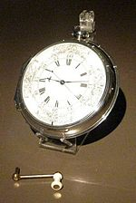

# Why the odd name?

:cherry_blossom: Historical background on how the library got its name

---

The short answer is:

The far more interesting answer is how John Harrison's "Sea watch No.1" came to be...

## The Longitude Prize

Prior to 1760, navigation had been a very hit-and-miss affair, while you could determine your position North or South of the equator (Latitude) by the stars, to accurately determine your distance East or West of....well...where? - you needed to know the exact time, and clocks of the day were notoriously *in*accurate. To the point where it was pretty easy to miss the West Indies for example.

It was such an important global issue that the UK offered a life-changing sum of money to the first person to come up with a method of accurately determining Longitude East / West of Greenwich, London, England. This essentially boiled down to being able to accurately keep time in rough conditions and all temperatures and weathers on board a ship.

In short: No-one was able to navigate accurately until they could properly keep time.

## John Harrison

John Harrison, a clockmaker, worked on the problem for years and eventually won the prize when he produced his "Sea watch No.1" in 1759. It was his fourth attempt and so was also know as the "H4". Hence the H4 was the first ever accurate time keeper known to man.

Now you "get" the significance of:

I urge you to read the [Full and fascinating story](https://en.wikipedia.org/wiki/John_Harrison)

And even: 

[Amazon.com link to the book](https://www.amazon.com/Longitude-Genius-Greatest-Scientific-Problem/dp/B005LYERBI/ref=sr_1_5?dchild=1&keywords=longitude+prize&qid=1612457760&sr=8-5)
## Fast-forward 250 years

The ESP8266 takes the IOT world by storm and rapidly becomes *the* MCU of choice for small IOT projects.

The problem is that in order to do multiple tasks at the same time, those tasks need to be properly sequenced and synchronised. That is no easy feat, requiring OS-like programming techniques and when I started looking at the '8266 back in oooh 2014 / 15 there was absolutely nothing that even came close.

Everyone was knocking out code that did one thing, maybe turn on a light, send a temperature value to mqtt etc...but the forums were full of people who wanted to do multiple things at once, had tried, failed, and were getting frustrated - including me.

In short: No-one was able to fully harness the power of the ESP8266 until they could synchronise their multiple tasks - the IOT equivalent of the 1750s

It was also clear that it was a non-trivial undertaking, well beyond newbies and even a lot of experienced programmers. Search as I might, I could find no easy starting point. When faced with that kind of situation, there is only one solution: roll-yer-own.

## The modern H4 is born

I then wrote a thing called "Esparto" which had at its heart a scheduler which could call timer functions synchronously and serialise all asynchronous events into a single queue on the main loop, which solved most of the problems of simple multitasking in one fell swoop. I then designed it so that it was easy for other people to slot their own code into the framework.

The central scheduler which can call lambda functions, class functions and any C++ "functor" was always known to me in my own mind as H4 since it was the IOT equivalent of Harrison's Sea Watch: the first way of accurately and safely running timed / scheduled tasks on ESP8266. Esparto grew to the point where I needed to separate out the core scheduler.

The main reason was that there is very little in H4 that is MCU specific and I wanted to "port" it to ESP32, STM32, Raspberry Pi and even linux, to give me the same higher-level and simple multitasking interface across all those systems. Thus H4 was born in its own right. Pretty soon afterwards, I started to add the "plugins" to get back to a "do anything iot" framework which is where you are right now: H4Plugins: A series of IOT functions that "plug-in" to the H4 scheduler.

It's just H4 with (a lot of) bells and whistles!

---

(c) 2021 Phil Bowles h4plugins@gmail.com

* [Youtube channel (instructional videos)](https://www.youtube.com/channel/UCYi-Ko76_3p9hBUtleZRY6g)
* [Facebook H4  Support / Discussion](https://www.facebook.com/groups/444344099599131/)
* [Facebook General ESP8266 / ESP32](https://www.facebook.com/groups/2125820374390340/)
* [Facebook ESP8266 Programming Questions](https://www.facebook.com/groups/esp8266questions/)
* [Facebook ESP Developers (moderator)](https://www.facebook.com/groups/ESP8266/)
* [Support me on Patreon](https://patreon.com/esparto)