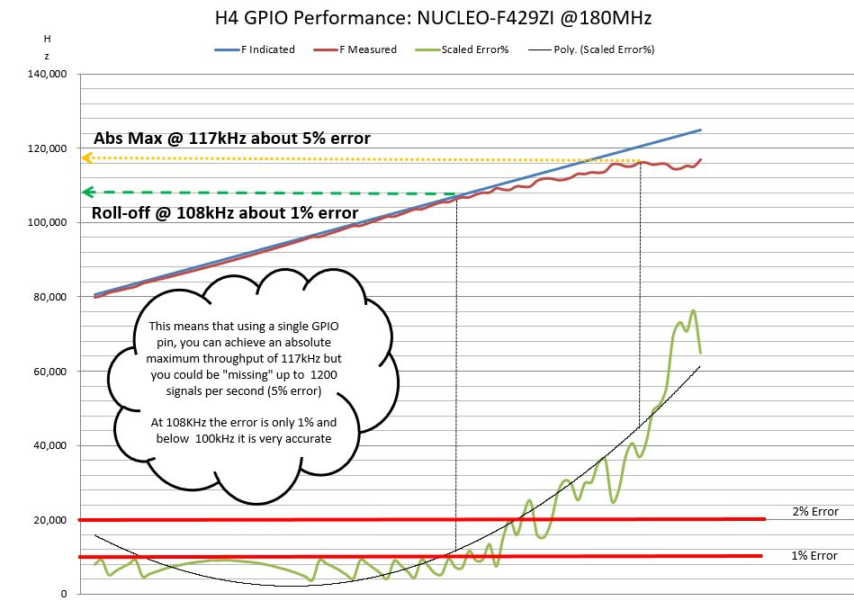

# External Square Wave Generator (short name "esqw")

## Adds driver/controller for Square Wave Generator module to H4 Universal Scheduler/Timer
*All plugins depend upon the presence of the [H4 library](https://github.com/philbowles/H4), which must be installed first.*

---

# What does it do?


Sends the relevant serial commands to set the F or DC value. Also it will "sweep" either F or DC from any valid value to any other higher valid value in user-defined steps at a user-defined rate.

During the sweep a callback function can be defined which will receive the current swept value.
Provides

* Frequency Set 0-150000 Hz
* Duty Cycle Set 0-100%
* Frequency Sweep
* Duty Cycle Sweep

---

# Usage

```cpp
#include<H4Plugins.h>
H4_USE_PLUGINS
H4P_ExternalSqWave h4esw(...
```

## Dependencies

If using STM32-NUCLEUO you must install the following HardwareSerial library
* https://github.com/plerup/espsoftwareserial

H4P_ExternalSqWave must be created after [**H4P_SerialCmd**](h4sc.md) if using that plugin

## Commands Added

* h4/esqw/set/d/x
* h4/esqw/set/f/y
* h4/esqw/stop
* h4/esqw/sweep/d/w,x1,x2,z (see below)
* h4/esqw/sweep/f/w,y1,y2,z (see below)

w is sweep value in milliseconds: how often the swept value changes
x is a Duty Cycle value from 0 - 100 as a percentage
y is a Frequency value from 0 - 150000 hz
z is an increment value: how much to increase the swept value each time it changes
x1 is the "from" x
x2 is the "to" x
y1 is the "from" y
y2 is the "to" y

## Callbacks

```cpp
void onChange(uint32_t sweptValue); // called when swept value changes
```

## Unloadable

NO

---

# API

```cpp
/* constructor:
rx is Hardware Serial RX pin number
tx is Hardware Serial TX pin number
initialF is starting Frequency value
initialD is starting Duty Cycle value
*/
H4P_ExternalSqWave(uint8_t rx,uint8_t tx,uint32_t initialF=0,uint32_t initialD=0);
//
void dSet(uint32_t d); // Set Duty Cycle
void dSweep(uint32_t timer,uint32_t fromF,uint32_t toF,uint32_t inc,function<void(uint32_t)> onChange=[](uint32_t){});
void fSet(uint32_t f); // Set Frequency
void fSweep(uint32_t timer,uint32_t fromF,uint32_t toF,uint32_t inc,function<void(uint32_t)> onChange=[](uint32_t){});
void stop(); // cancels any sweep in progress
```

[Example code](../examples/H4ESW/H4P_ESWSimple/H4P_ESWSimple.ino)

---

## Practical Example: Profiler

During the development of H4 and H4Plugins, it was important to ensure that the code could give the best GPIO performance. All GPIO pins are handled by the [H4P_GPIOManager](h4gm.md) on the main loop, so the maximum throughput of *all* GPIO is shared among a value which can be measured as "loops per second".

If there is only one active input, then this value is the maximum rate of pin changes that can handled on that hardware. In order to find this value, the device had the 50% duty cycle output fed back into a `Raw` pin which does no processing on the values.

The External Square Wave Generator was then swept from low F to High F in steps. At the end of each step, the `Raw`pin's internal value `Rpeak` was read (and reset to 0 for the next step) and compared with the indicated value of F.

Thes values were then printed to the serial monitor and cut and pasted into Microsoft Excel at the end of the sweep to show the point at which the indicated F starts to differ markedly from the measured F. This point is known "in the business" as the "fall-off" or "roll-off" point. Beyond this, the pin changes are coming in too fast for [H4P_GPIOManager](h4gm.md) to handle them and count them accurately. Below the roll-off point, it does a pretty good job.

Below is an example of one of the graphs produced, when running the profiler on STM32-NUCLEOF429ZI



[Profiler code](../examples/H4ESW/H4P_ESWProfiler/H4P_ESWProfiler.ino)

---

(c) 2020 Phil Bowles h4plugins@gmail.com

* [Youtube channel (instructional videos)](https://www.youtube.com/channel/UCYi-Ko76_3p9hBUtleZRY6g)
* [Blog](https://8266iot.blogspot.com)
* [Facebook Esparto Support / Discussion](https://www.facebook.com/groups/esparto8266/)
* [Facebook H4  Support / Discussion](https://www.facebook.com/groups/444344099599131/)
* [Facebook General ESP8266 / ESP32](https://www.facebook.com/groups/2125820374390340/)
* [Facebook ESP8266 Programming Questions](https://www.facebook.com/groups/esp8266questions/)
* [Facebook IOT with ESP8266 (moderator)}](https://www.facebook.com/groups/1591467384241011/)
* [Facebook ESP Developers (moderator)](https://www.facebook.com/groups/ESP8266/)
* [Support me on Patreon](https://patreon.com/esparto)
