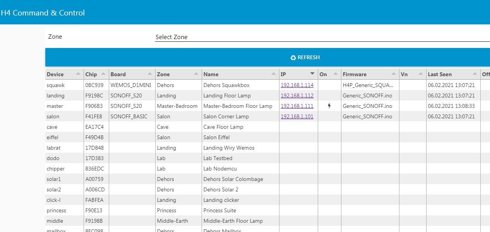

 

# H4P_AsyncMQTT

## Service shortname mqtt

Connects to an MQTT server and manages automatic reconnection after failure. Provides utility functions to simplify message handling / parsing. User will find essential pre-reading [Handling MQTT topics / commands](mqcmds.md)

---

## Contents

* [Usage](#usage)
* [Dependencies](#dependencies)
* [Commands Added](#commands-added)
* [Service Commands](#service-commands)
* [API](#api)

---
# Usage

```cpp
H4P_WiFi h4wifi(...
H4P_AsyncMQTT cutie(...
```

This plugin is a "singleton" - there may be only one single instance of it in the app. 
It may be instantiated as any name the user chooses, prefix all API calls below with that name.

## Dependencies

* [H4P_WiFi](h4wifi.md)

## Commands Added

* `h4/mqtt/change/v,w,x,y,z` (payload: v=scheme [http|https], w=broker,x=uname,y=passwd,z=port) e.g. https,192.168.1.4,,,1883
* `h4/mqtt/report` // display basic details about the device

# Service Commands

`stop` will disconnect from MQTT and initiate closedown of all Plugins that depend on MQTT
`start` will connect to MQTT and start all dependent services

# Callbacks

```cpp
uint32_t onMessage(vector<string>); // where "onMessage" is a user-defined topic handling function
```

# Topics automatically published

Publishes `h4/< your device name >/offline` when it loses the MQTT connection.

It publishes `h4/< your device name >/report` with a JSON payload of e.g.

```JSON
{
    "bin": "Generic_SONOFF.ino",
    "board": "D1_MINI",
    "h4P": "1.0.1",
    "ip": "192.168.1.118",
}
```

Immediately after connection to the server.

These allow 3rd party software e.g. NODE-RED to maintain a list of all devices on the network and gain sufficient information from each to query and / or control their status. For example, this is a screenshot of the authors' NODE RED server see [Advanced Topics](advanced.md) for more details



---

# API

```cpp
/*
Constructor

optional Last Will and Testament structure:
*/
struct H4P_LWT {
    const char*     topic;
    const char*     payload;
    int      QOS;
    bool     retain;
};
//
// user / pass optional if server requires authentication
//
// url remote server format "http://host:port/path/?a=b..." can start https://. port, path, query all optional
// e.g. "http://myserver.local:1883"
// lwt = optional Last Will and Testament for custom LWT message
//
H4P_AsyncMQTT(string url, string user="",string pass="",H4P_LWT lwt={"","",0,false});
//
void addReportingItem(const string& ri); // adds global config item ri to the list of values oncluded on `report`
void change(const string& url,const string& user,const string& passwd);
void publishDevice(const string& topic,const string& payload,uint8_t qos=0, bool retain=false); // publish <device>/topic with string payload
void publishDevice(const string& topic,uint32_t payload,uint8_t qos=0, bool retain=false); // publish <device>/topic with numeric payload
void report(); // publishes golbal config item values as JSON
void subscribeDevice(string topic,H4_FN_MSG f,H4PC_CMD_ID root=H4PC_ROOT); // call f when <device>/topic message received
void subscribeDevice(initializer_list<string> topic,H4_FN_MSG f,H4PC_CMD_ID root=H4PC_ROOT); // multiple topics in one call
void unsubscribeDevice(string topic);
void unsubscribeDevice(initializer_list<string> topic)
```

## Example sketches

* [Subtopics](../examples/07_MQTT/H4P_MQTT_Subtopics/H4P_MQTT_Subtopics.ino)
* [Wildcards](../examples/07_MQTT/H4P_MQTT_Wildcards/H4P_MQTT_Wildcards.ino)
* [Custom Last Will and Testament](../examples/07_MQTT/H4P_MQTT_CustomLWT/H4P_MQTT_CustomLWT.ino)
  
---

(c) 2021 Phil Bowles h4plugins@gmail.com

* [Youtube channel (instructional videos)](https://www.youtube.com/channel/UCYi-Ko76_3p9hBUtleZRY6g)
* [Facebook H4  Support / Discussion](https://www.facebook.com/groups/444344099599131/)
* [Facebook General ESP8266 / ESP32](https://www.facebook.com/groups/2125820374390340/)
* [Facebook ESP8266 Programming Questions](https://www.facebook.com/groups/esp8266questions/)
* [Facebook ESP Developers (moderator)](https://www.facebook.com/groups/ESP8266/)
* [Support me on Patreon](https://patreon.com/esparto)