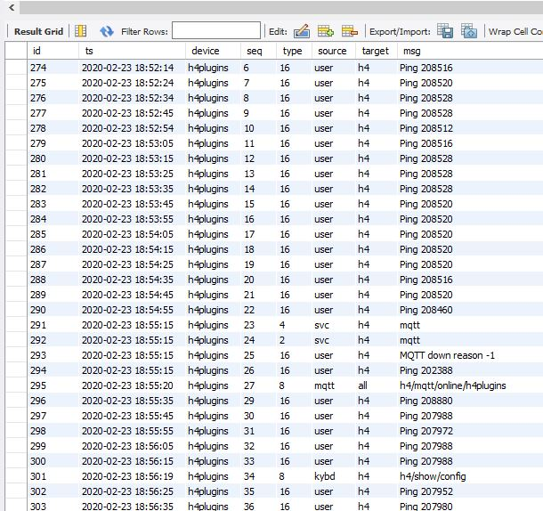

# Remote MySQL logger

## Adds MySQL logging H4 Universal Scheduler/Timer + Plugins. [ESP8266 / ESP32 only]

*All plugins depend upon the presence of the [H4 library](https://github.com/philbowles/H4), which must be installed first.*

---

# EXPERIMENTAL! (Minimal Error Handling, possible Queue overflow + crash if driven too fast)

---



---
# What does it do?

The H4P_HttpMySQLLogger fits into the H4Pluins Logging strategy and you *must* read that [documentation](h4logs.md) first if you have not already done so!

It simply send each matching event to an Http server. An example [server](../examples/H4P_HttpMySQLLogger/mysqlrest/README.MD) is provide using nodejs and express.

# What information gets logged?

The logging interface sends the following data items to the server in a POST message:

* Device name

* Event sequence number (starts from 0 at reboot - see below)
  
* Msg: the content of the message
  
* Event type
  
* Source: Origin of the event

* Target: 

These fields are described in the [general logging documenatation](h4logs.md)

---

# H4P_SerialLogger (name "hlog")

## Usage

```cpp
#include<H4Plugins.h>
H4_USE_PLUGINS
H4P_WiFi(...
H4P_HttpMySQLLogger h4mysql(...
```
## Prequisites

* Remote HTTP Server
* Remote MySQL Database
* H4P_WiFi Plugin

## Additional Commnds

none

## Callbacks

void onFail(int error); // called when connection fails. error code is one of: 

```cpp
#define HTTPCODE_CONNECTION_REFUSED  (-1)
#define HTTPCODE_SEND_HEADER_FAILED  (-2)
#define HTTPCODE_SEND_PAYLOAD_FAILED (-3)
#define HTTPCODE_NOT_CONNECTED       (-4)
#define HTTPCODE_CONNECTION_LOST     (-5)
#define HTTPCODE_NO_STREAM           (-6)
#define HTTPCODE_NO_HTTP_SERVER      (-7)
#define HTTPCODE_TOO_LESS_RAM        (-8)
#define HTTPCODE_ENCODING            (-9)
#define HTTPCODE_STREAM_WRITE        (-10)
#define HTTPCODE_TIMEOUT             (-11)
```

## Unloadable

NO

---

## API

```cpp
H4P_HttpMySQLLogger(const string& ipaddress,H4P_FN_HTTPFAIL onFail=nullptr,uint32_t filter=H4P_LOG_ALL): 
// ipaddress must be the fully-qualified url including the port and MUST HAVE A TRAILING "/"
// e.g. "http://192.168.1.20:8266/"
// onFail will get called if it cannot connect
// filter has the same meaniung as other loggers
```

[Example Code](../examples/H4P_HttpMySQLLogger/H4P_HttpMySQLLogger.ino)

---

# Advanced topics

## Suggested MySQL schema

```cpp
CREATE TABLE `event` (
  `id` int(11) NOT NULL AUTO_INCREMENT,
  `ts` timestamp NOT NULL DEFAULT CURRENT_TIMESTAMP,
  `device` varchar(16) NOT NULL,
  `seq` int(11) NOT NULL,
  `type` int(11) NOT NULL,
  `source` varchar(16) DEFAULT NULL,
  `target` varchar(16) DEFAULT NULL,
  `msg` varchar(128) DEFAULT NULL,
  PRIMARY KEY (`id`),
  UNIQUE KEY `id_UNIQUE` (`id`)
) ENGINE=InnoDB AUTO_INCREMENT=1821 DEFAULT CHARSET=utf8mb4 COLLATE=utf8mb4_0900_ai_ci;
```

## Rate and sequencing

The time T taken for a single event to get logged depends on a number of factors:

* Speed / efficiency / ram / config / loading of the MySQL server
* Speed / efficiency / ram / config / loading of the Webserver
* Network speed / latency
* Task loading, of H4 and your app activity

While it is therefore impossible to predict, two things are certainly true:

* It is *not* instantaneous
* It can easily take several tens or possibly hundreds of milliseconds

The plugin cannot handle a second transaction until it has received a reply from the first, therefore it queues any intervening requests if there is already one "in-flight".

It s obvious that if the rate of sending is much shorter than the average time T to despatch an event, then the queue will build rapidly. This will eat up RAM and slow down H4 causing the queue to grow even faster...until BANG!.

If you send requests at a sustained rate faster than T **YOU *WILL* CRASH YOUR MCU**

You can't fight physics. The good news is that in testing on a 6-core 3.6GHz machine with 16GB RAM running Windows 10 x64, MySQL 8 and nodejs 12.16.1 the example sketch could *easily* send a sustained rate of 20 per second (i.e. 50ms between events) with only the occasional, manageable spike on the queue.

Even at 40/sec (25ms interval) it could still manage, but there were occasional spikes of queue growth up to 30 and beyond with a correspondingly large drop in free heap to dangerous levels. Trying anything below 10ms interval (100 events / sec) is pretty much guaranteed to crash the MCU, the only real question is *when* rather than *if*

The simple solution is don't log rapid events for long periods!

## Sequencing

Once there had been an "in-flight" overlap and there are events in the queue, it cycles around them continuously until the the previous one has finished. Thus it is impossible to predict which one gets pulled form the queue - it will be the one it happens to be be looking at when the previous one succeeds.

For this reason, a unique ever-increasing sequence number is added to each event, so when looking at the logs in the database, **it is essential to sort them into sequence order** before trying to reconstruct an accurate timeline.

---

(c) 2020 Phil Bowles h4plugins@gmail.com

* [Youtube channel (instructional videos)](https://www.youtube.com/channel/UCYi-Ko76_3p9hBUtleZRY6g)
* [Blog](https://8266iot.blogspot.com)
* [Facebook Esparto Support / Discussion](https://www.facebook.com/groups/esparto8266/)
* [Facebook H4  Support / Discussion](https://www.facebook.com/groups/444344099599131/)
* [Facebook General ESP8266 / ESP32](https://www.facebook.com/groups/2125820374390340/)
* [Facebook ESP8266 Programming Questions](https://www.facebook.com/groups/esp8266questions/)
* [Facebook IOT with ESP8266 (moderator)}](https://www.facebook.com/groups/1591467384241011/)
* [Facebook ESP Developers (moderator)](https://www.facebook.com/groups/ESP8266/)
* [Support me on Patreon](https://patreon.com/esparto)
