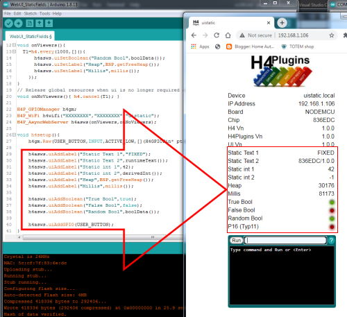
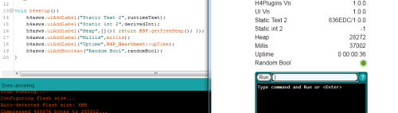
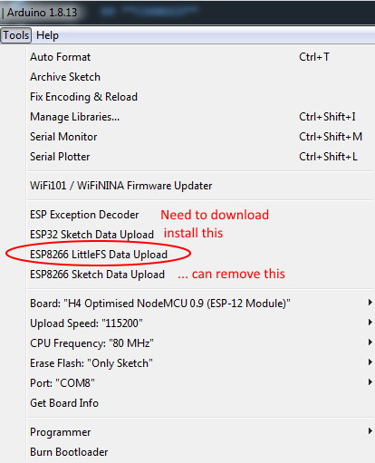

 

# Release Notes v1.0.0

## Introduction

A Major version number milestone, reflecting the continued stability of the library. The main changes are:

* Incorporation of the latest version of [PangolinMQTT](https://github.com/philbowles/PangolinMQTT) (1.0.0)
* Change from obsolescent SPIFFS to the recommended LittleFS
* New webUI functions to allow user to add dynamic fields, input, dropdown etc
* A new plugin H4P_Heartbeat which calls user function 1x per second
* A few minor bug fixes and code tidying / optimisation
* STM32 / STM32Duino support withdrawn
* Tested with Core 2.7.4 and IDE 1.8.13

---

## **BUGS FIXED**

* BinaryThing/Switch did not show initial state correctly in webUI

## **NEW**

* H4P_Heartbeat Plugin
* User webUI additions
  * Static fields
    Labels, info, GPIO pin status as red/green LED

  * Dynamic fields
    As above, but change value automatically in realtime when UI visible

  * Input fields
    Input box, dropdown list, clickable boolean "LED"

  * [New API calls](h4asws.md)
      * uiAddBoolean
      * uiAddDropdown
      * uiAddGPIO
      * uiAddInput
      * uiAddLabel
      * uiMessage
      * uiSetInput
      * uiSetBoolean
      * uiSetLabel
      * uiSync
      * callback onUiChange
  * New Examples
    * [Static user fields](../examples/WEBUI/WebUI_StaticFields/WebUI_StaticFields.ino)
    * [Dynamic user fields](../examples/WEBUI/WebUI_DynamicFields/WebUI_DynamicFields.ino)
    * [User input fields](../examples/WEBUI/WebUI_InputFields/WebUI_InputFields.ino)

## **CHANGED**

  * [PangolinMQTT](https://github.com/philbowles/PangolinMQTT) upgraded to v1.0.0
  
    Reflecting its continued stability, [PangolinMQTT](https://github.com/philbowles/PangolinMQTT) has matured to version 1.0.0. There have been some changes to its API, and since [H4P_AsyncMQTT](h4mqtt.md) is a "wrapper" around PangolinMQTT, you may need / choose to re-visit your API usage. For example there are several new (and easy to use) API calls for dealing with specific data types in the payload.

    The error-handling has been improved and you may alo want to add the new `onMqttError` callback handler for more information on any connection problems.

  * SPIFFS Replaced by LittleFS (ESP8266 Targets)

    Users should notice very little change: The main change is to download the [LittleFS upload tool](https://github.com/earlephilhower/arduino-esp8266littlefs-plugin) and add it to the IDE and use this where previously you used "ESP8266 Sketch Data Upload"

    SPIFFS remains for ESP32 Targets

---

## **REMOVED**

N/A

---

(c) 2020,2021 Phil Bowles h4plugins@gmail.com

* [Youtube channel (instructional videos)](https://www.youtube.com/channel/UCYi-Ko76_3p9hBUtleZRY6g)
* [Blog](https://8266iot.blogspot.com)
* [Facebook H4  Support / Discussion](https://www.facebook.com/groups/444344099599131/)
* [Facebook General ESP8266 / ESP32](https://www.facebook.com/groups/2125820374390340/)
* [Facebook ESP8266 Programming Questions](https://www.facebook.com/groups/esp8266questions/)
* [Facebook IOT with ESP8266 (moderator)](https://www.facebook.com/groups/1591467384241011/)
* [Facebook ESP Developers (moderator)](https://www.facebook.com/groups/ESP8266/)
* [Support me on Patreon](https://patreon.com/esparto)
