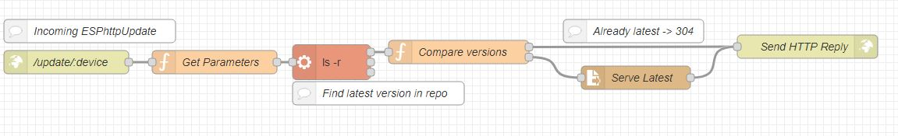

# Running a Remote Update Server

:gem: Essential background for deploying/updating binaries **O**ver-**T**he-**A**ir. Users should familiar with [Generic Binaries](generix.md) before reading this document.

Users may also find this Youtube video helpful, look for the red label "Expert" series [1. Running a remote update server on Nide-RED](https://youtu.be/zNjafa-4QEw)
helpful

---

# Contents

* [Introduction](#introduction)
* [The basic task](#the-basic-task)
* [Target binary Identifiers](#target-binary-identifiers)
* [An example Server](#a-server)
* :door: [H4 Update NodeRed Flow](../assets/nodered/H4Updater_flow.json)

---

# Introduction

OTA updating has been a feature of the ESP8266 and '32 platforms from their introduction. Most users will have come across it as an alternative to a physical wired USB->UART connection when uploading a new sketch.

Once a user has a body of devices deployed to various physical locations around the home, updating them all starts to become tedious and impractical unless OTA is used, especially if devices have been installed in difficult locations (or impossible, i.e. behind a wall) .

The most practical solution is to have a central repository (the "repo") of binaries for each hardware type deployed "in the field". The ESP8266 core supports this concept with it "Remote Update" functionality. H4Plugins leeverages this to provide an simple way to automatically update various classes of devices OTA.

If you are not already familiar with the low level features of what is required of the server by the ESP8266 core implmentation, read the [excellent documentation]( [Generic Binaries](generix.md). It provides everything you need to set up your own server in your favourite language: PHP? NodeJs/Express? It's entirely up to you. This author preferes Node-RED and cused the documentation as the basis for the implementation described here. 

---

# The basic task

In its simplest from we would like our bianry to ask the server "Am I running the latest version of *me*?". We can either be told, "Yes, carry on!" or "No, there's a more recent version available".

In practical terms, to reduce the "handshaking" the call boils down to an HTTP request to "give me the latest binary of me" which will either succeed and return the new binary that is pumped straight into the update / reboot-as-newer-version process or an HTTP error 304, meaning "You are already the latest version"

That's really all there is to it...the tricky part is what does "*me*" mean? How are binaries and their versions named / identified? That has as many answers as there are readers, so we will concentrate on just one: the H4Plugins way.

## Classifying binaries

It is fairly self-evident that even with the same / similar source code two different MCU families e.g. ESP8266 and ESP32 will require two different binaries. What is less obvious is that whether that holds true of similar boards within the same MCU family - after all an ESP8266 chip is identical on all boards. The only things that differ between boards are things like the board wiring, flash memory/speed and onboard "peripherals" or features.

For this reason it can be possible for code compiled for one board to run 100% correctly on a totally different board

### By specific board type

Considering the Wemos D1 Mini as an example

* D1 Mini Lite has 1MB Flash
* "standard" D1 Mini has 4MB Flash
* D1 Mini Pro has 16MB Flash

Obviously a `pro` binary cannot be uploaded to a `lite` - In this case, a single common source code would probably require 3 different binaries in the repo, and the requesting code would need to know its board type as well as its current version.

### By general board type or "family"

On the other hand, consider the ITEAD "Sonoff" family of cheap and simple IOT switches. it inlcudes:

* Basic (no frills inline 2-pin low power switch ideal for e.g. lamps)
* S20 (moulded passthru 3-pin power socket)
* SV ("safe voltage") 12V version of a Basic, with extra GPIO pins
* RF 433MHz bolt-on to a Basic

For the moment we will ignore the two LEDs that the S20 has, the extra GPIO pins on the SV and the fancy 433MHz receiver on the RF. Once those differences are removed from the equation, the builtin relay is always on GPIO 12, the button is always GPIO 0 and the built-in LED is always correctly identified by the arduino build system as LED_BUILTIN.

This means that if your app only uses those features then a single binary will work in all of those devices, they are all 1MB flash and everything else "just works". In *this* scenario the board only needs to know its own "general board type" i.e. "itead" and current version.

### By functionality

It may be that the user has a deployment containg only D1 minis, but that half of them perform a lighting role and half perform a pir-detection role. In this scenario the user might have a "lighting.ino" sketch and a "pir.ino" sketch and the code would need to know its own sketch name to be able to to get its latest version (the MCU type is implicitly understood to be D1 mini)

### Other methods

* network subnet
* specific MAC address
* ...

The possibilities are many - it depends entirely on the users own ecosystem / infrastructure, but the summary is the code need to pass to the update server:

* Current version
* target binary identifiers, whatever they may be


## Flash File system images SPIFFS(32) and LittleFS(8266)

The same mechanism for firmware updates is used to upload Flash File System (FFS) images. If a new webUI is built then only the FFS needs to be updated. In some case you may absolutely *NOT* want the code updated at the same time.

For this reason, firmware updates and FFS updates are two distinct processes. Also for this reason, a sketch needs to know the FFS size of its target MCU as these differ and can be chosen by the user and you cannot fit a 2MB FFS image into an MCU that has only space for 64kb! The minimum size of the H4Plugins webUi image is 96kb.

The recommended FFS size for H4Plugins deployment is:

* ESP8266 device with 4MB Flash: 1MB FFS
* ESP8266 device with 1MB Flash: 96kB
* ESP32 devices: 1MB FFS

Devices in the 1MB class requiring 96kB need some special handling as only 64kB and 128kB options are available in the default settings of the IDE. 64kB is too small for the minimum file set (even though the  total actual file data sizes amount to < 30kB ). 128KB leaves insufficient room to be able to OTA the largest of the H4Plugins apps you may need to build.

H4Plugins provides a 96kb option via its :building_construction: [Additional board defintions](board.md) and that document should be studied if you wish to deploy any 1MB devices over OTA.

Obviously then, the update server also needs to mainatain a version-controlled FFS image repo, and binaries must be able to report the desired FFS size.

### FFS tools

The [LittleFS folder](../LittleFS) contains `fs.bat` which will build the FFS images for 1MB and 4MB ESP8266 devices for easy deployment to the update server. It produces:

* fs_1M.bin
* fs_4M.bin

The [SPIFFS folder](../SPIFFS) contains `spiffs.bat` which will build the SPIFFS images ESP32 devices in a similar manner.

---

# Target binary Identifiers

We have seen that the data by sketch identifies itself to the update server over and above the current version can be many and varied. H4Plugins provides a simple mechanism to collect the data and foward to the the central controller using the MQTT `report` topic.

This concatenates any / all the data items the user chooses and publishes them automatically every time it connects. These, when added to the "basic set" provided by the ESP core must provide sufficient information for the update server to identify the latest binary of its class and return it OTA-style if it is a later version.

## Built-in basic set

Full documentation of the [ESP8266 update server](https://arduino-esp8266.readthedocs.io/en/latest/ota_updates/readme.html#http-server) shows us that the following special header fileds are sent to the server "for free":

```cpp
[User-Agent] => ESP8266-http-Update
[x-ESP8266-STA-MAC] => 18:FE:AA:AA:AA:AA
[x-ESP8266-AP-MAC] => 1A:FE:AA:AA:AA:AA
[x-ESP8266-free-space] => 671744
[x-ESP8266-sketch-size] => 373940
[x-ESP8266-sketch-md5] => a56f8ef78a0bebd812f62067daf1408a
[x-ESP8266-chip-size] => 4194304
[x-ESP8266-sdk-version] => 1.3.0
[x-ESP8266-version] => DOOR-7-g14f53a19
[x-ESP8266-mode] => sketch
```

Note that we don't get the sketch name or board type... if these items are required we must provide them ourselves.

## Adding more binary identifiers

As delivered, H4Plugins sends the following data fields in its `report` message:

* sketch binary .ino "terminal" name (i.e. *not* the full path)
* H4Plugins version number
* webUI FFS version
* IP address

Users can easily add to the list for their own ecosystem naming scheme with the [H4P_AsyncMQTT](h4mqtt.md) API:

```cpp
void  addReportingItem(const string& ri);
```

Which adds the named global variable to the data reported to the server

---

# A server

You are now in the position of having all the information required to write your own remote update server using your technology of choice.

The author's own Node-RED / JS implementation is included here as a guide.



The broad synopis is:

1. An HTTP request is received with a path ending `.../update/yourdevicename` the value `yourdevicename` is used in the node "Get Parameters" to retrieve the data that was previously saved when `yourdevicename` sent its reporting values at connection time. At this point, the server flow has all the information it needs about the requesting binary.

2. It must now retrieve from the repo the version number of any binary that matches the identifiers and get its version number. It does this by using the server command `ls -r` which gives a list of names in reverse order, meaning that the highest (i.e. most recent) version is now the first itme in the list.

3. The repo version and requestor version are compared. If the repo is newer, it returns the binary in OTA chunks to the requestor, else it returns error 304

The exported flow can be found here:

[H4 Update NodeRed Flow](../assets/nodered/H4Updater_flow.json)

---

(c) 2021 Phil Bowles h4plugins@gmail.com

* [Youtube channel (instructional videos)](https://www.youtube.com/channel/UCYi-Ko76_3p9hBUtleZRY6g)
* [Facebook H4  Support / Discussion](https://www.facebook.com/groups/444344099599131/)
* [Facebook General ESP8266 / ESP32](https://www.facebook.com/groups/2125820374390340/)
* [Facebook ESP8266 Programming Questions](https://www.facebook.com/groups/esp8266questions/)
* [Facebook ESP Developers (moderator)](https://www.facebook.com/groups/ESP8266/)
* [Support me on Patreon](https://patreon.com/esparto)