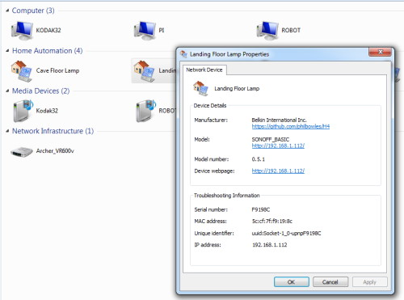

 

# Switches and "Things" (shortname="onof")

## Link on/off/toggle commands to a GPIO or functional object for H4 Universal Scheduler/Timer.

*All plugins depend upon the presence of the [H4 library](https://github.com/philbowles/H4), which must be installed first.*

---

# What do they do?

Let's not forget that "IOT" is the Internet of *Things*. So what is a "Thing"? The answer is: *anything you want it to be*. In H4 Plugins terms, it is an object that holds an interal `state` of `ON` or `OFF` and reacts to commands `on`,`off`,`toggle` and `switch`. If you are using the  [H4P_MQTT plugin](h4mqtt.md) it publishes the `state` topic whenever the state changes. A Switch is a just a Thing with a predefined output function linked to a single GPIO.

There can only be one *output* Thing (or Switch) in a sketch/app: it is effectively the default handler for the above commands. It is what your device does when any source ( [Serial](h4sc.md), [MQTT](h4mqtt.md), [HTTP REST](h4asws.md) or [linked GPIO input connector](h5gpio.md) ) sends an `on`,`off`,`toggle` or `switch` command.

You can have many *input* [linked GPIO input connector](h5gpio.md)s all linked to the single *output* Thing. 

## Simple Example

Assume you have an output GPIO on pin 12 wired to a relay that controls security light

Now add some inputs:
* Pushbutton on GPIO0
* PIR sensor on GPIO4
* Magnetic reed switches on front door (GPIO5) and window (GPIO6)

You define the output GPIO12 as a BinarySwitch:

```cpp
#include<H4Plugins.h>
H4_USE_PLUGINS
H4P_BinarySwitch h4bt(12,ACTIVE_HIGH,OFF);
```

Even before adding anything else you can now switch on the light  when any source ( [Serial](h4sc.md), [MQTT](h4mqtt.md), [HTTP REST](h4asws.md) or [linked GPIO input connector](h5gpio.md) ) sends an `on`,`off`,`toggle` or `switch` command.

Next, add the sensors and tie them all to the `BinarySwitch` `h4bt`

```cpp
H4P_GPIOManager h4gm;

void h4setup(){
    h4gm.LatchingThing(0,INPUT,ACTIVE_LOW,15,&h4bt); // 15ms debounce timeout
    h4gm.RetriggeringThing(4,INPUT,ACTIVE_HIGH,10000,&h4bt); // 10sec motion timeout
    h4gm.DebouncedThing(5,INPUT,ACTIVE_HIGH,15,&h4bt); // door alarm
    h4gm.DebouncedThing(5,INPUT,ACTIVE_HIGH,15,&h4bt); // window alarm
}
```

Now the light go on when any of the following happen:

* You press the button
* The door opens
* The window opens
* Motion is detected
* ON command recived from any source, e.g. MQTT etc

The light will go off when:

* You press the button again when its ON for any reason
* The door closes
* The window closes
* The PIR "times out" after 10 seconds.
* OFF command recived from any source, e.g. MQTT etc

Not bad for 5 lines of code, eh?

## More advanced example

Now assume that instead of the light going ON you want your device to send you an SMS

1. Write the SMS function to send ON / OFF notifications.
2. Change the **H4P_BinarySwitch** to a **H4P_BinaryThing** and give it the name of your SMS function

That's it - the rest is the same.

## xThing vs xSwitch Summary

* xThing calls a user-defined function with `bool` value when `on`,`off`,`toggle` or `switch` command is received
* xSwitch drives a GPIO HIGH or LOW when  `on`,`off`,`toggle` or `switch` command is received

---

## UPNP variants

Both **H4P_BinaryThing** and **H4P_BinarySwitch** have UPNP versions

* H4P_UPNPThing
* H4P_UPNPSwitch

The add functionality to the non-UPNP versions

* Amazon Alexa voice control ON or OFF
* Windows10 desktop integration



---

## Overall summary

Your app can contain exactly one of these

* H4P_BinaryThing
* H4P_BinarySwitch
* H4P_UPNPThing
* H4P_UPNPSwitch

And as many GPIO input connectors as you need, to make your app do whatever it needs to do

* AnalogThresholdThing [Example Code](../examples/H4GM_AnalogThresholdThing/H4GM_AnalogThresholdThing.ino)
* DebouncedThing [Example Code](../examples/H4GM_DebouncedThing/H4GM_DebouncedThing.ino)
* EncoderThing [Example Code](../examples/H4GM_EncoderThing/H4GM_EncoderThing.ino)
* LatchingThing [Example Code](../examples/H4GM_LatchingThing/H4GM_LatchingThing.ino)
* PolledThing [Example Code](../examples/H4GM_PolledThing/H4GM_PolledThing.ino)
* RawThing [Example Code](../examples/H4GM_RawThing/H4GM_RawThing.ino)
* RetriggeringThing [Example Code](../examples/H4GM_RetriggeringThing/H4GM_RetriggeringThing.ino)
* [H4P_ThreeFunctionButton](h43fnb.md) [Example Code](../examples/H4P_SONOFF_Basic/H4P_SONOFF_Basic.ino)

---

 
---
# Usage

```cpp
#include<H4Plugins.h>
H4_USE_PLUGINS
H4P_GPIOManager h4gm;
// H4P_AsyncWebServer h4asws(... if using the UPNP variants
H4P_BinarySwitch h4onof;
// OR H4P_UPNPSwitch h4onof;
// OR H4P_BinaryThing h4onof;
// OR H4P_UPNPThing h4onof;
```

## Dependencies

* [H4P_GPIOManager](h4gm.md) Plugin

## Commands Added

* h4/off
* h4/on
* h4/switch/n (payload = 1 or 0)
* h4/toggle (invert current state)
* h4/state // report state

// UPNP variants only
* h4/upnp/name/N (payload N= new UPNP "friendly name")
  
## Topics automatically published

If [H4P_MQTT](h4mqtt.md) is also used, this plugin publishes `h4/< your device name >/state` with a payload set to the current state whenever the state changes

## Unloadable

No

---

# API

```cpp
/* Constructor
pin is the GPIO output which gets "switched" when the state changes
sense is ACTIVE_HIGH or ACTIVE_LOW depending on the device
inital is the starting state ON or OFF
onChange is the name of  a user function that gets called after the state change with b set to the current state see GPIOManager plugins for more details
btp is a r
*/
H4P_BinarySwitch(uint8_t pin,H4GM_SENSE sense, uint8_t initial,H4BS_FN_SWITCH onChange=[](bool){});
H4P_UPNPSwitch(string& upnpName,uint8_t pin,H4GM_SENSE sense, uint8_t initial,H4BS_FN_SWITCH onChange=[](bool){});
H4P_BinaryThing(uint8_t pin,H4GM_SENSE sense, uint8_t initial);
H4P_UPNPSwitch(string& upnpName,uint8_t pin,H4GM_SENSE sense, uint8_t initial);

void turnOff();
void turnOn();
void toggle(); // invert state
void turn(bool b); // b = new state: 1 or 0; true/false; ON/OFF

// UPNP variants
void friendlyName(const string& name); // sets UPNP friendly name. Causes a reboot

```

# Output Examples

[Example Sketch - BinaryThing](../examples/H4P_BinaryThing/H4P_BinaryThing.ino)
[Example Sketch - BinarySwitch](../examples/H4P_BinarySwitch/H4P_BinarySwitch.ino)
[Example Sketch - BinarySwitch with 3-function button](../examples/H4P_BinarySwitch3fnb/H4P_BinarySwitch3fnb.ino)
[Example Sketch - BinarySwitch with MQTT](../examples/H4P_BinarySwitchMQTT/H4P_BinarySwitchMQTT.ino)
[Example Sketch - UPNPSwitch with MQTT](../examples/H4P_SONOFF_Basic/H4P_SONOFF_Basic.ino)

---
# Input Examples

You need to read the [H4P_GPIOManager](h4gm.md) documentation before using these

[Example Sketch - AnalogThresholdThing](../examples/H4GM_DebouncedThing/H4GM_DebouncedThing.ino)
[Example Sketch - DebouncedThing](../examples/H4GM_DebouncedThing/H4GM_DebouncedThing.ino)
[Example Sketch - EncoderThing](../examples/H4GM_EncoderThing/H4GM_EncoderThing.ino)
[Example Sketch - LatchingThing](../examples/H4GM_LatchingThing/H4GM_LatchingThing.ino)
[Example Sketch - PolledThing](../examples/H4GM_PolledThing/H4GM_PolledThing.ino)
[Example Sketch - RawThing](../examples/H4GM_RawThing/H4GM_RawThing.ino)
[Example Sketch - RetriggeringThing](../examples/H4GM_RetriggeringThing/H4GM_RetriggeringThing.ino)

---

# Advanced Topics

## Installation of Windows components for UPNP variants

***N.B.** It seems Windows has a bug(!) in handling Wemo UPNP devices. Until this is fixed or a workaraound is found, the only way to activate your H4 device using UPNP is indirectly via MQTT*

Until such time as an installation script is written (soon, I promise :) ) getting the windows functionality is a bit of an ordeal, I'm afraid.

The first thing you need to do is to locate you Arduino library installation folder for H4Plugins, it will be something like `C:\Users\phil\Documents\Arduino\libraries\H4Plugins`

The files you will need are in the `src` subfolder

1. Install Powershell if you dont already have it and set it up so that it can run code without needing admin rights More information [here](https://superuser.com/questions/106360/how-to-enable-execution-of-powershell-scripts) 

2. Install [m2mqtt](https://github.com/eclipse/paho.mqtt.m2mqtt) You may find it easier to first install [nuget.exe](https://www.nuget.org/downloads) and run `nuget.exe install M2Mqtt -o c:\lib`

3. Edit h4p.reg and change the location in the final to match your username  Then right-click on that file and select "Merge" to add it to the registry

---

## Device naming of UPNP variants

If no name is given in the constructor, it defaults to "upnp XXXXXX" where XXXXXX is the unique chip ID of the device (usually the last 6 characters of the MAC address).

This is useful to enable a single generic sketch to be uploaded to numerous devices without change. Each device should then be sent a `h4/upnp/name` command to give it a "sensible" name. This can be done by any MQTT client using stored messages (or e.g. NODE-RED), so that each device gets its own new name every time it reboots.

## Precedence

The situation is a little different if the device has a name defined in the constructor. Assume this is "firstname". When given a `h4/upnp/name` command with a payload of "secondname", it will reboot as - no surprises - "secondname".

By default, it will stay as "secondname.local" until the next factory reset. After that it will return again to "firstname" until either another host command changes it, or a new value is compiled in.

In some circumstances, you may want it to always revert to the compiled in name "firstname" even after a `h4/upnp/name` command. The default behaviour described above can be changed by editing `H4PConfig.h` and setting `H4P_PREFER_PERSISTENT` to `false`.

---

## "Tweakables"

The following values are defined in `H4PConfig.h` . They are chosen initally to set a good balance between stability, performance and memory / stack usage. *It is not advisable to change them unless you know exactly what you are doing and why*. 

**N.B.** **Support will not be provided if any of these values are changed.**

* H4P_UDP_JITTER

The number of milliseconds entropy between successive UPNP bradcasts, to minimise queue growth and UDP "flooding".

* H4P_UDP_REFRESH

The number of milliseconds "lifetime" between UPNP "keepalive" broadcasts

* H4P_UDP_REPEAT

The integer number of repeat UDP messages sent on each occasion to prevent packet loss

---

(c) 2020 Phil Bowles h4plugins@gmail.com

* [Youtube channel (instructional videos)](https://www.youtube.com/channel/UCYi-Ko76_3p9hBUtleZRY6g)
* [Blog](https://8266iot.blogspot.com)
* [Facebook Esparto Support / Discussion](https://www.facebook.com/groups/esparto8266/)
* [Facebook H4  Support / Discussion](https://www.facebook.com/groups/444344099599131/)
* [Facebook General ESP8266 / ESP32](https://www.facebook.com/groups/2125820374390340/)
* [Facebook ESP8266 Programming Questions](https://www.facebook.com/groups/esp8266questions/)
* [Facebook IOT with ESP8266 (moderator)}](https://www.facebook.com/groups/1591467384241011/)
* [Facebook ESP Developers (moderator)](https://www.facebook.com/groups/ESP8266/)
* [Support me on Patreon](https://patreon.com/esparto)
