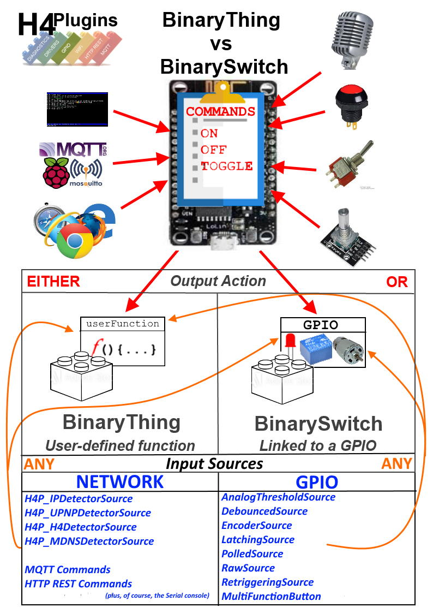

 

# "Things" and "Switches""

:gem: Essential background information before using any of:

* :door: [H4P_BinaryThing](swings.md)
* :door: [H4P_ConditionalThing](swings.md)
* :door: [H4P_BinarySwitch](swings.md)
* :door: [H4P_ConditionalSwitch](swings.md)

[Watch Youtube Video](https://youtu.be/fLUKDAboAU8)

# Contents

* [What is a "Thing"?](#what-is-a-thing)
* [Linking your Thing/Switch to input events](#link-to-h4pe_xxxx-event)
* [Master / Slave linkage](#slaves)

---

# What is a "Thing"?

Let's not forget that "IOT" is the Internet of *Things*. So what is a "Thing"? The answer is: *anything you want it to be*. In H4 Plugins terms, it is an object that holds an internal `state` of `ON` or `OFF` and reacts to commands `on`,`off`,`toggle` , `switch` and `auto`. It provides a fat-finger-friendly graphcial on/off button (The "big red switch") in the webUI if you use [H4P_WiFi](h4wifi.md) and if you are using the  [H4P_AsyncMQTT plugin](h4mqtt.md) it automatically publishes its internal `state` whenever it changes.

If your app only needs to switch a single GPIO like a relay or a lamp, then a "Switch" is what you need. A Switch is a just a Thing whose only action is to feed the on/off commands to a single selceted GPIO pin, whereas "Things" can do whatever they want when switched on: play a tune, send a message to a remote server, grab a snapshot from a security camera etc...

"Things" drive user-defined functions, "Switches" drive single GPIOs - in every other respects they behave exactly the same way. You can turn them on or off, that's pretty much it. They also have an "auto off" feature (which is great for energy-saving) which will turn them off automatically after a user-defined amount of time, no matter how they got switched on. If you leave it at zero the Thing or Switch will stay in the ON state until commanded OFF in some other way.

# Linking your Thing/Switch to other functions:

There can only be one *output* Thing (or Switch) in a sketch/app. It is *the* default handler for any `on` or `off` command. On the *input* side of things, you can have as many ways as you like to trigger it.

You should already be familiar with [Serial Commands](ccc.md), [MQTT](h4mqtt.md), [HTTP REST](h4wifi.md), [UPNP device](upnp.md) (e.g. Amazon Alexa voice command) as different ways to send `on`,`off`,`toggle` or `switch` commands to you device.

## Link to H4PE_xxxx event

In addition, you may also link *any* H4Plugins event to the default device using `H4P_ONOFF_CONNECTOR(e)` (read [Everything is an event: Listeners, Emitters and Handlers](events.md)). 
## Other Thing/Switch drivers

* [h4pMultifunctionButton](basic.md#h4pmultifunctionbutton) [Example Code](../examples/XTRAS/H4P_SONOFF_Basic/H4P_SONOFF_Basic.ino)

The [h4pMultifunctionButton](basic.md#h4pmultifunctionbutton) provides an easy way to switch your Thing/Switch with a physical button. The "Multi-function" aspect of it also allows you to reboot the device or factory reset it, depending on how long you hold the button down. A simple short "stab" though serves as your device's on/off button.

The [UPNPServer](upnp.md) provides (among other things) the abiity to detect Amazon "Alexa" voice commands an pass them to the Thing/Switch but also makes the device appear on the user's Windows desktop where it can also be switched on/off 

## Thing vs Switch Summary

* BinaryThing calls a user-defined function with `bool` parameter when `on`,`off`,`toggle` or `switch` command is received
* BinarySwitch drives a GPIO HIGH or LOW when  `on`,`off`,`toggle` or `switch` command is received
* ConditionalThing is a BinaryThing that only operates when user-defined function returns `true`
* ConditionalSwitch is a BinarySwitch that only operates when user-defined function returns `true`
* Only **one** Thing or Switch per app

This picture is slightly out-of-date but should give you an idea of how these all "hang together". For example, all of the "sources" have been replaced by the `H4P_ONOFF_CONNECTOR(e)` event connector mentioned [above](#link-to-h4pe_xxxx-event)

---

# Slaves

Things and Switches can be linked to each other so that when one turns on, it automatically triggers another to turn on too. You can link groups of similar devices together in this way. The controlling device is the "master" and the automatically linked device is the "slave".

This - of course - also works for "off". If the "master" has an auto-off time set, then all of it slaves will behave as if they did too, even though they may not behave that way when switched directly. That is unless each slave has it own auto-off setting...

The important thing to realise is that the master does not control / override the slaves directly, it simply "forwards" its own state to them as a command. So if a master with no auto-off timer switches on a slave and that slave has its own specific auto-off time of 5 seconds, then it will go off after five seconds, even though the master stays on "forever".

By the same token if the master has a *shorter* auto-off time than the slave - say 3 seconds in the above example - then all the slaves will go off after 3 seconds whether they have their own 5 second auto-off timers or not!

When you use any of these in your app, they automatically add `h4/slave` to the list of available commands. See [Things/Switches API](swings.md) for details on how to use it.

## Setting up master / slave linkage

You need to include :building_construction: [H4P_LinkMaster](h4plink.md) in your sketch, which also adds the `slave` command. See that documentation for full details.

---

(c) 2021 Phil Bowles h4plugins@gmail.com

* [Youtube channel (instructional videos)](https://www.youtube.com/channel/UCYi-Ko76_3p9hBUtleZRY6g)
* [Facebook H4  Support / Discussion](https://www.facebook.com/groups/444344099599131/)
* [Facebook General ESP8266 / ESP32](https://www.facebook.com/groups/2125820374390340/)
* [Facebook ESP8266 Programming Questions](https://www.facebook.com/groups/esp8266questions/)
* [Facebook ESP Developers (moderator)](https://www.facebook.com/groups/ESP8266/)
* [Support me on Patreon](https://patreon.com/es