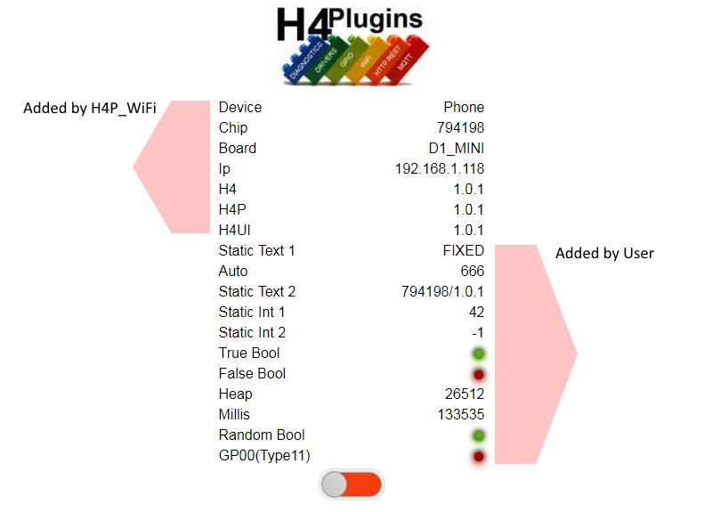

 

# Customising the web User Interface (webUI)

[H4P_WiFi](h4wifi.md) allows the user to add their own fields to the web user interface.

---

## Contents

* [Static Fields](#static-fields)
* [Dynamic Fields](#dynamic-fields)
* [Input Fields](#input-fields)

---

# Static vs Dynamic fields

Some fields show data that is know well before the webserver starts and will never change, for example the ESP's hardware chip ID.
[H4P_WiFi](h4wifi.md) calls these "static" fields and there is not much more to them than giving them a name and a value.

Fields whose values change over time are known as "dynamic" and those fall into two categories:

* Fields whose value is not known prior to webserver startup, but does not change afterwards, e.g. IP address
* Fields whose value can change at any time

---

# Static fields

This is the webUI when running the example sketch [Web UI static fields](../examples/WEBUI/WebUI_StaticFields/WebUI_StaticFields.ino)



## Static text

Here's how we added the first user field:

```cpp
h4wifi.uiAddLabel("static text 1","FIXED"); // gets "proper cased"
```

## Static integers

...with something very similar when we have integer values we need to add:

```cpp
h4wifi.uiAddLabel("Static int 1",42);
```

## Static bool "LED"s

We can also get fancy red/green LED indicators for data we can show as on/off, yes/no etc:

```cpp
h4wifi.uiAddBoolean("True Bool",true);  
h4wifi.uiAddBoolean("False Bool",false);
```

A special form of  boolean field can show the state of a GPIO pin as we have done in the example for GPIO0. You need to be familiar with [H4P_PinMachine](h4gm.md) to understand the type number an the way that H4Plugins manages GPIO pins.

## Global "config items" shortcut

If you are not familiar with `global config items`, read [Static and Utility functions](statics.md#dealing-with-global-variables), specifically the section "Dealing with global variables".

```cpp
h4wifi.uiAddLabel("myGlobal");
```

... creates a field with the current value of the global variable of the same name;

## Manually updating static fields

When we come to the other fields, we have something a little different. It's almost a "halfway house" between static and dynamic fields. The important thing to remember about static fields is not that they can never change, it's that ***they do not change automatically***, unlike dynamic fields, which change whenever they feel like it.

If you want the value of  static field to change, then you must do it yourself using `uiSet...` functions.

Notice that when we added the fields we want to change, we saved the return value form the `uiAdd...` function.

```cpp
myHeap=h4wifi.uiAddLabel("Heap",ESP.getFreeHeap());  
myMillis=h4wifi.uiAddLabel("Millis",millis());  
myRandomBool=h4wifi.uiAddBoolean("Random Bool",boolData());
```

We need this to send it a new value later:

```cpp
TIM0=h4.everyRandom(2500,5500,[](){ h4wifi.uiSetBoolean(myRandomBool,boolData()); });
TIM1=h4.every(1000,[](){
    h4wifi.uiSetLabel(myHeap,ESP.getFreeHeap());  
    h4wifi.uiSetLabel(myMillis,millis());
});
```

Dynamic fields do a lot of this automatically - but to do so, they need to operate differently from static fields.

---

# Dynamic Fields

[H4P_WiFi](h4wifi.md) uses DHCP addressing, so the webserver starts - by definiton - it does not know its own IP address, but we do know we want to display it on the webUI. What we need is a function that will return the current IP address when the webserver gets a user request. Think of it as a "delayed value getter function".

When the webUI gets a request, it can look down all of the fields and see which ones have a "delayed value getter function" and then call that function and put the result into the web page, something like this:

```cpp
h4wifi.uiAddLabel("IP",[](){ return WiFi.localIP().toString().c_str(); })
```

Thus all the `uiAdd...` functions have a variant that takes a string-returning function instead of a fixed string value. The "getter" function is called by the webUI when it needs to display the field, (which may be never);

You can see this in action in the example sketch [web UI Dynamic Fields](../examples/WEBUI/WebUI_DynamicFields/WebUI_DynamicFields.ino)

## Single-shot vs Repeating fields

In our IP example, once we have set the field to the current IP, it never changes again during this run of the code. It is inefficient and wasteful therefore, to call its "getter" function every time a user views the page. H4Plugins calls this a "single-shot" dynamic field.

On the other hand if we want to show the current "Up Time" every second, or the changing state of a GPIO pin, we *do* need to keep updating the field. We need a *repeating* dynamic field. For this reason, all of the `uiAdd...` APIs with "getter functions also have a `repeat` parameter. If you set that `true`, then the field will update as and when it needs to. Leaving it as the default `false` reults in a single-shot field whose value "getter" is called once only when the page first loads.

## When do we update? Sync vs Async

The webUI should maintain as close as possible a view of the actual state of the device. When the device is ON, the "Big Red Switch" should be come a "Big GREEN Switch" - but don't forget it's not just this web UI that can change it: a physical button, an MQTT message for example can also change it, and the webUI has no control over when that happens. These events are *asynchronous*.

By comparison, our "Up Time" fields needs to change every second, on the second, as do other fields. This leads us to two different methods of automatic update, both calling the `uiSync` API

## Asynchronous dynamic update

The async version of `uiSync` needs to be told which field just changed. Obviously, you will have had to save the field's ID returned from the `uiAdd...` call as described [above](#manually-updating-static-fields)

```cpp
h4WiFi.uiSync(myAsyncFieldID);
```

The good thing about this is that you do not need to know its value, just that it *changed*. The webUI will just call the field's repeating "getter" function and display whatevre is returned. This keeps the UI up-to-date in real-time.

## Synchronous dynamic update

Calling

```cpp
h4WiFi.uiSync();
```

...with no specific field ID tells the webUI to run down its list of repeatable getter functions and call each in turn.

While this *can* be called at any time, it makes much more sense for it to be called from  periodic timer, or when it is known for certain that several values have all changed. To prevent problems [described here](faq.md#webui) you need to keep the amount of web traffic as low a possible, so lazily and needlessly updating a whole load of fields that haven't actually changed is, well...needless and lazy.

---

# Input Fields

The webUI offers the following methods of input

* Clickable Boolean
* Text Box
* Dropdown List

All of the API calls have a "change function" callback which is called with the new value. If this is not specified, then the field name and new value are passed to the global callback `onUiChange` see [Static and Utility functions](statics.md#global-callbacks) for more details.

They can all be seen "in action" in the example sketch [Web UI Input Fields](../examples/WEBUI/WebUI_InputFields/WebUI_InputFields.ino)

## Clickable Boolean

Very similar to the static boolean [above], but when given a change function (and set to repeat) it becomes clickable to allow the user to change some linked binary state automatically. This is what [H4P_AsnycMQTT](h4mqtt.md) uses to allow the user to manually connect/disconnect from the MQTT server just by clicking on the LED.

## Text Box

Not much more to say on this one:

```cpp
uint32_t uiAddInput(const string& name,const string& value="",H4P_FN_UICHANGE onChange=nullptr);
```

## Dropdown List

The HTML `option` / `value` pairs are contained in a `H4P_NVP_MAP` data structure, which is simply an std::unordered_map<std::string,std::string>, e.g.

```cpp
h4wifi.uiAddDropdown("Select",{
    {"Both Cases","BcBc"},
    {"Uppercase","UUUU"},
    {"Lowercase","llll"}
});
```

---

(c) 2021 Phil Bowles h4plugins@gmail.com

* [Facebook H4  Support / Discussion](https://www.facebook.com/groups/444344099599131/)
* [Facebook General ESP8266 / ESP32](https://www.facebook.com/groups/2125820374390340/)
* [Facebook ESP8266 Programming Questions](https://www.facebook.com/groups/esp8266questions/)
* [Facebook ESP Developers (moderator)](https://www.facebook.com/groups/ESP8266/)
* [Support me on Patreon](https://patreon.com/esparto)