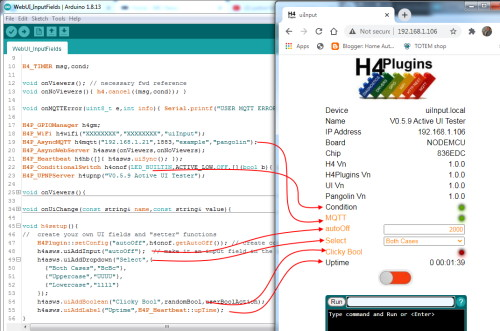

 

# WiFi and the web UI

[H4P_WiFi](h4wifi.md) allows the user to add their own fields to the web user interface.

---

## Contents

* [General](#-general)
* [WebUI Introduction](#webui-introduction)
* [Code Walkthrough](#code-walkthrough)
    * [Setup](#setup)
    * [Content Display](#content-display)
    * [Manage / Control](#manage--control)
* [Input Fields](#input-fields)
* [Foreign / unknown data](#pulling-in-foreign--unknown-data)

---

# General

The default operating mode is Station Mode (`WIFI_STA`) requiring an SSID and a password (or "pre-shared key, PSK). While the plugin *can* run in Access Point mode, special action is required, as discussed in a separate document: :building_construction: [WiFi AP mode](ap.md)

## Automatic reconnection

[H4P_WiFi](h4wifi.md) continually monitors connection to the AP and will shut down all dependent services, e.g. MQTT, UPNP if the connection breaks. It will automatically restart those services once the APP connection is restored.

In the nmeanwhile, the app can continue as normal, servicing hardware, readong sensors etc: a poor connection will *not* cause or require a reboot (as many other libaries / firmwares do - who knows why?)

Because of this the user should be careful to structure her app so that it does not request such services when they are not actualyy available. In 99% of cases those services will simply do nothing, return zero etc if they are called when there is no connection, but it is pointless and inefficient to do so. This is just a reminder that the user should never write code (in *any* situation, not just in H4Plugins) that relies on, is dependent upon or expects there always to be a live and valid connection to the net.

## Signalling

[H4P_WiFi](h4wifi.md) tries to give a visual indication of the current connection state. If the board has a builtin LED, it will flash that in a Morse code S-O-S pattern (... --- ...) when the connection is lost. To do that, it needs to make assumptions about the LED such as its pin number, whether it is active high or low and what colour it is (for the UI visualisation). These can all be changed by editing [config_plugins.h](../src/config_plugins.h) and changing:

* `#define H4P_ASSUMED_LED      LED_BUILTIN`
* `#define H4P_ASSUMED_SENSE     ACTIVE_LOW`
* `#define H4P_ASSUMED_COLOR H4P_UILED_BLUE`

...to the values that are right for your target MCU

---
# WebUI Introduction

You should have already read and understood how H4Plugins uses :gem:[Global Variables and persistent storage](globals.md). An additional feature is that they are very easy to add to the webUI.

Adding a user-defined field to the webUI usually requires that it first exists as a `gv` named value. Once it has been added you may change its value at any time and if it is an input field, it will emit `H4PE_GVCHANGE` events when the user updates it.

To set the scene, look at the webUI from the ["Static Fields" example sketch](../examples/06_WEB_UI/WebUI_StaticFields/WebUI_StaticFields.ino)

* [WebUI Introduction](#webui-introduction)


The coloured panels are called "sections" and the "u" section is highlighted in the red box. While you can add fields to *any* section, you need to know its section id and I'm not telling you any, so stick to the "u" section till you become more expert.

# Code walkthrough

```cpp
#include<H4Plugins.h>
H4_USE_PLUGINS(115200,H4_Q_CAPACITY,false) // Serial baud rate, Q size, SerialCmd autostop

boolean condition=false;
boolean boolData(){ return random(0,50) > 25; } // randomly return true / false

H4_TIMER  TIM0,TIM1;

H4P_WiFi h4wifi("XXXXXXXX","XXXXXXXX","uistatic");
H4P_AsyncMQTT kewpie("http://192.168.1.4:1883");
H4P_ConditionalSwitch h4onof([]{ return condition; },D6,ACTIVE_HIGH);

void onViewersConnect(){
  Serial.printf("Ever get that feeling someone is watching you?\n");
  
  h4wifi.uiAddGlobal("global"); 
  h4wifi.uiAddBoolean("True Bool");  
  h4wifi.uiAddBoolean("False Bool");
  h4wifi.uiAddBoolean("Random Bool");
  
  h4wifi.uiAddText("Millis",millis());  

  TIM0=h4.everyRandom(5000,10000,[](){
    h4wifi.uiSetValue("Random Bool",boolData());
    condition=random(0,100) > 50;
    h4pUIMessage("Sync condition now %d",condition); 
    h4onof.syncCondition();
  });
  TIM1=h4.every(1000,[](){ h4wifi.uiSetValue("Millis",millis()); });       
}

void onViewersDisconnect(){ h4.cancel({TIM0,TIM1}); }

H4P_EventListener evthandler(H4PE_VIEWERS | H4PE_GVCHANGE,[](const string& svc,H4PE_TYPE t,const string& msg){
  switch(t){
    case H4PE_VIEWERS:
      H4P_SERVICE_ADAPTER(Viewers);
      break;
  }
});

void h4setup(){
  // creat globals that will be mapped to the UI
  h4p.gvSetInt("True Bool",1);
  h4p.gvSetInt("False Bool",0);
  h4p.gvSetInt("Random Bool",boolData());
  h4p.gvSetstring("global","variable");
}
```

## Overall structure

There are three main blocks to the code. In *logical* order

* create the variables we will add to the web UI in `h4setup`
* display / update / change the content in `onViewersConnect`
* manage / control UI from event handler `evthandler`

### Setup

The name of the variable will be "Proper Cased" for aesthetic reasons. Note that we did not create a variable for the `millis`. This is because we don't need a separate place (the global variable) to hold its value, it already somewhere deep inside the MCU in a clock chip. We simply retrieve its value using `millis()` whenever we need it.

Similarly any static value like a label or some fixed data you have that will rarely change, can use the `addText` API call that does not create the extra overhead of a named variable for each field (but you lose some magic, see later). For example:

```cpp
h4wifi.uiAddText("Author","Phil Bowles");
```

## Content display

Apart from fairly static `Text` fields already discussed, the UI values are taken from the current value of the global variable of the same name. The magic of this is that when anything changes that value, the `H4PE_GVCHANGE` event is generated, and [H4P_WiFi](h4wifi.md) listen for those and - of course - then updates the disply to show the current value in real-time.

In *some* situations, only the user knows when the UI needs to change. The main case is when using [H4P_ConditionalSwitch](swings.md) or [H4P_ConditionalThing](swings.md) whose condition may depend on external factors like a GPIO state or some complex calculation that cannot be reduced to, or stored in, a global variable.

To keep the UI in sync in those cases, the user would call the `syncCondition` API that those plugins offer

Similary those `Text` fields do not *have to* stay fixed: after all, in the example we update the `millis` field every second. But because those fields don't have the automatic `H4PE_GVCHANGE` mechanism, the user needs to change them him/herself with the `setValue` API.

## Manage / control

We must never forget we are running on a very limited platform with a very small heap. Running a webserver takes a lot of "oomph" so we have to manage it carefully to minimise any impact. 
### Resource creation / deletion

The first obvious point is that we only ever need any of these resources when someone is looking at the webpage, so by creating them "just in time" we reduce the average amount of heap memory used.

This is why the `H4PE_VIEWERS` event exists. It fires (with a message of 1) when some user opens up the webUI and again (with a message of zero) when they get bored and go away. We use this to minimise out footprint by using the 1 event to create all our resources and the 0 event to close them all down cleanly.

This is the *only* place you should perform these actions: if you do it anywhere else, then either you will run out of heep pretty quickly or you will get out-of-sync with the UI and the actual field values, or both. Stick to the above structure.

### Keeping the noise down

It is a sadly unavoidable truth that some of the 3rd-party libraries required for a webserver are not as stable as they ought to be, even when we use our own versions of [Forked ESPAsyncTCP](https://github.com/philbowles/ESPAsyncTCP) and [Forked ESPAsyncWebserver](https://github.com/philbowles/ESPAsyncWebServer). We must however live in the real world and manage that problem.

Even if those libraries were rock-solid there are still limits to the number of fields you can add before running out of memory and there are also limits on the amount and rate of data you can safely send to / from the UI. WiFI networks do not have infinite speed or capacity!

The combination of the amount of data you send and how often you send it can be combined together into a quantity we will call "bandwidth". If you exceed that bandwidth, your app will crash, it's that simple. H4Plugins provides some ways to help detect / prevent that, but if you ignore them (or try hard) you can still crash the app.

#### Rule 1

Keep the number of fields to the absolutely essential minimum

#### Rule 2

Only send new data *when it has changed*. This may sound obvious, but I have lost count of the number of times i have seen programmers lazily "send the value anyway to avoid the 'if' comparison" thinking that they are cleverly optimising something...In this case, they are indeed reducing something: the length of time their app will stay alive :) Don't be like them!

#### Rule 3

Even when the data changes very rapidly, you should still limit the updates. The human eye can only perceive 15-20 changes per second before it all blurs into one (ever seen a movie?) so updating an LED field at 25fps is pointless as well as problematic for the limited bandwidth.

#### Know when to back off

No, this has not suddenly changed to life-coaching (although that is indeed a useful life skill...) this is the last-ditch attempt by H4Plugins to protect you from yourself if you break any of the 3 rules above and start to exceed a manageable bandwidth.

Each UI update requires messages to be sent over the net between you and the viewer. That path is limited by: your network speed, the degree of RF interference, the shape / size / construction of your building, the size of the LWIP buffers you compile in and probably the current Bitcoin exchange rate too. The point is that it is impossible to give exact figures for what follows, but it is essential to understand the mechanism.

If you send messages faster than the net can forward them to the user's browser, a backlog queue will start to build up. If your code is patchy / random and not in a relentless send! send! send! loop, there will be "gaps" in time in which the background tasks can clear that queue and keep things down to a dull roar, allowing you to shove a few more messages in from time to time.

So while your pattern of sending can be quite "bursty" at times, it needs to back off occasionally too. You need to keep your *average* bandwidth this side of the problem zone. That value can only be found by experiment with *your* app as it is not only net-dependent but also heap-dependent. If your app use a lot of heap, then the safe UI bandwidth will be greatly reduced.

The only thing [H4P_WiFi](h4wifi.md) can do is stop sending your data when that limit is getting close. That will allow the pipeline to drain, and when it comes back down to a safe level, [H4P_WiFi](h4wifi.md) will again allow your UI updates to get through, taking the current value from the matching global variable so the final view as the dust settles should still match reality. :cherry_blossom: And *that* dear reader, is *why* user fields need to have a global associated with them.  

---
# Input Fields

The webUI offers the following methods of input

* Text Box using `uiAddInput`
* Dropdown List using `uiAddDropdown`
* Image Buttons

(More will be added in a future release)

There is not much to say about the input field. but for the dropdown list, the HTML `option` / `value` pairs are contained in a name/value pair `H4P_NVP_MAP` data structure, which is simply an std::unordered_map<std::string,std::string>, e.g.

```cpp
h4wifi.uiAddDropdown("Select",{
    {"Both Cases","BcBc"},
    {"Uppercase","UUUU"},
    {"Lowercase","llll"}
});
```

## Images and ImgButtons

Images may be added to the UI by specifying their URL with with: `uiAddImg` API

They can be used as actionable buttons if instead you use `uiAddImgButton` This requires having two similar images in the FS with name of xxx0.jpg and xxx1.jpg, for example:

 pink0.jpg

 pink1.jpg

It is much easier to see / try than to describe, take a look at the [WebUI Input Fields](../examples/06_WEB_UI/WebUI_InputFields/WebUI_InputFields.ino) example tht looks like this when running:



The `ImgButton` can operate in two modes when using the predefined CONNECTORS:

* `H4P_TACT_BUTTON_CONNECTOR( X )`
* `H4P_LATCH_BUTTON_CONNECTOR( X )`

In `..._TACT_...` mode, the button simply springs back to the 0 state once released and "fires" an `H4PE_GVCHANGE(0)` event on the upstroke, simulating a physical tact button.

In `..._LATCH_...` mode ,the button stays latched in the new position and fires on each state change. Click it once it fires `H4PE_GVCHANGE(1)` and stays in the 1 state. Click again it fires `H4PE_GVCHANGE(0)` and stays in the 0 state

Example usage as seen in [Example Sketch](../examples/06_WEB_UI/WebUI_InputFields/WebUI_InputFields.ino)

```cpp
H4P_EventListener allexceptmsg(H4PE_VIEWERS | H4PE_GVCHANGE,[](const string& svc,H4PE_TYPE t,const string& msg){
  switch(t){
...
    case H4PE_GVCHANGE:
      H4P_TACT_BUTTON_CONNECTOR(Go);
      H4P_LATCH_BUTTON_CONNECTOR(pink);
      break;
  }
});
```

---

# Pulling in foreign / unknown data

Everything we have talked about so far has involved using our own data. If you use the [H4P_AsyncHTTP](h4phttp.md) Plugin you can easily retrieve a wide variety of data from external websites and / or remote APIs and it is not always possible to know in advance what data will come back.

Ultimately you *do* need to know the exact structure, format and range of content for foreign data you pull in if you are to manage the UI well. However it is sometimes really handy to have a "first sniff" at a potential site that returns, say, some simple JSON data. In this one special case there are two AP calls you will appreciate:

* `globalsFromSimpleJson` in [H4P_AsyncHTTP](h4phttp.md)
* `uiAddAllUsrFields` in this plugin

You need to be familiar with [H4P_AsyncHTTP](h4phttp.md) to get the best out of `globalsFromSimpleJson` but the "executive summary" for the current discussion is that it takes a JSON data (*usually* from a remote site, but it *can* be from anywhere) and for every data item, creates a `gv` global with the prefix of "usr_".

You should now be able to guess what `uiAddAllUsrFields` does...yes it adds all `gv` variables starting with "usr_" to the webUI (hiding the "usr_" part), reducing what would otherwise be a very complex task to:

```cpp
#include<H4Plugins.h>
H4_USE_PLUGINS(115200,H4_Q_CAPACITY,false) // Serial baud rate, Q size, SerialCmd autostop
H4P_WiFi h4wifi("XXXXXXXX","XXXXXXXX","webuinclusions");
H4P_AsyncHTTP ah;
void h4pGlobalEventHandler(const string& svc,H4PE_TYPE t,const string& msg){
  switch(t){
    case H4PE_SERVICE:
      if(svc=="http" && (!h4p.gvExists("usr_country"))) {
        ah.GET("http://ip-api.com/json/",[](ARMA_HTTP_REPLY r){ ah.globalsFromSimpleJson(r); }); 
      }
      break;
    case H4PE_VIEWERS:
      if(atoi(msg.data())) h4wifi.uiAddAllUsrFields(); 
      break;
  }
}
```

... and here's the result:


You normally wouldn't monitor the `H4PE_SERVICE` event of [H4P_AsyncHTTP](h4http.md) (service shortname is "http") but we only ever want to do this the very first time the app gets a connection to the net. Now I cheated a little as I knew in advance that there is a field in the JSON data called "country" so once we have had a successful call to the remote site, "usr_country" will exists and we don't need to make the call again. This just happened to be the quickest and most obvious (to me, at least) way of making the call one-time-only

---

(c) 2021 Phil Bowles h4plugins@gmail.com

* [Youtube channel (instructional videos)](https://www.youtube.com/channel/UCYi-Ko76_3p9hBUtleZRY6g)
* [Facebook H4  Support / Discussion](https://www.facebook.com/groups/444344099599131/)
* [Facebook General ESP8266 / ESP32](https://www.facebook.com/groups/2125820374390340/)
* [Facebook ESP8266 Programming Questions](https://www.facebook.com/groups/esp8266questions/)
* [Facebook ESP Developers (moderator)](https://www.facebook.com/groups/ESP8266/)
* [Support me on Patreon](https://patreon.com/esparto)